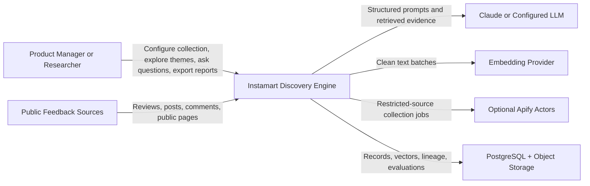
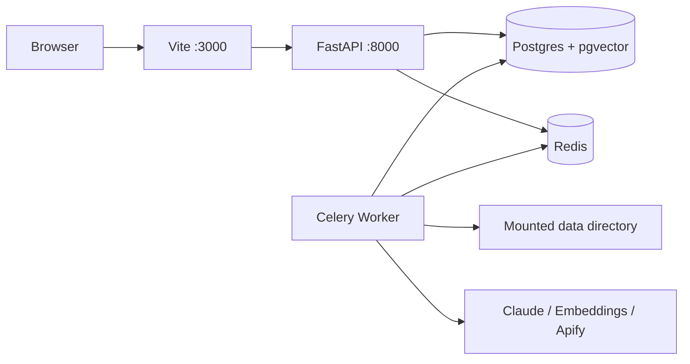
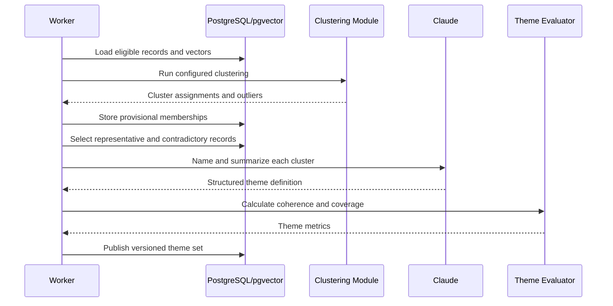
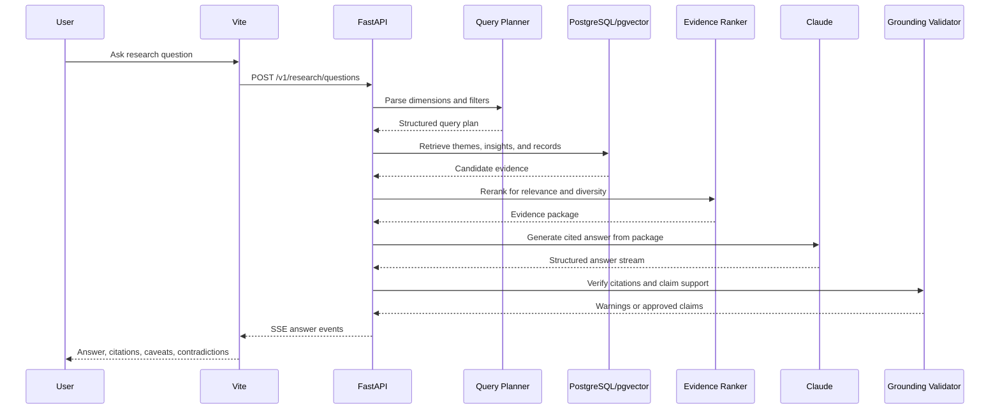

# System Architecture: Instamart Discovery Engine

## 1. Purpose

This document defines the technical architecture for the **Instamart Discovery Engine** described in `context.md`.

It explains how the system will:

- collect public user feedback from multiple sources;
- preserve raw evidence and collection metadata;
- normalize, classify, embed, and group feedback;
- generate traceable themes and product insights;
- answer research questions using grounded retrieval;
- expose the workflow through a production-quality Vite + React application;
- validate the quality of classifications, themes, retrieval, and generated claims.

Detailed visual design, page composition, animation direction, typography, and component styling are intentionally excluded. Those decisions belong in `design.md`.

This document should be read together with `datamodel.md` (canonical entities implementing these service boundaries), `edgecases.md` (expected failure and recovery behaviour for this architecture), and `ai_evals.md` (how the AI gateway and pipeline outputs defined here are evaluated and gated for release).

---

## 2. Architecture Decision Summary

The MVP will use the following architecture:

| Layer | Decision |
|---|---|
| Frontend | Vite, React, React Router, TypeScript, Tailwind CSS, shadcn/ui-style primitives, Framer Motion |
| API | FastAPI with versioned REST endpoints and Server-Sent Events for streamed AI answers and job progress |
| Application shape | Modular monolith for the backend, supported by separate background-worker processes |
| Background processing | Celery workers with Redis as broker and short-lived cache |
| Primary database | PostgreSQL with pgvector |
| Raw artifact storage | Local filesystem in development; S3-compatible object storage in hosted environments |
| Data processing | Python, Pydantic, Polars or Pandas, scikit-learn, HDBSCAN where appropriate |
| AI reasoning | Claude API behind a provider-neutral AI gateway |
| Embeddings | Configurable local sentence-transformer or hosted embedding provider |
| Collection | Direct source adapters first; Playwright and Apify only when needed |
| Database migrations | Alembic |
| Observability | Structured logs, job-run records, model-call audit records, metrics-ready instrumentation |
| Testing | Pytest, contract tests, frontend component tests, Playwright end-to-end tests |
| Local orchestration | Docker Compose |
| CI | Lint, type-check, test, migration check, and production build |

The backend will initially remain one codebase and one deployable API service. Long-running tasks will execute in worker processes so the API remains responsive.

---

## 3. Architectural Goals

### 3.1 Evidence traceability

Every theme, insight, generated answer, score, and report statement must be traceable to stored feedback records.

The lineage should be navigable in both directions:

```text
Source page or review
    -> Raw document
    -> Normalized feedback record
    -> Structured analysis
    -> Theme membership
    -> Insight evidence
    -> Generated answer or report
```

### 3.2 Grounded AI usage

LLMs will interpret, classify, name, synthesize, and explain. They will not be trusted to:

- calculate dataset counts without database queries;
- invent user segments;
- infer unavailable demographic information;
- determine source metadata;
- silently remove records;
- produce an insight without evidence identifiers;
- make causal claims from public text alone.

### 3.3 Reproducibility

Each processing run must retain:

- input dataset version;
- prompt version;
- taxonomy version;
- model and embedding configuration;
- thresholds and scoring weights;
- execution time;
- success, failure, and skipped counts;
- generated artifact identifiers.

### 3.4 Local-first development

The complete MVP should run from VS Code using Docker Compose and documented commands. Hosted services may improve convenience, but the architecture must not require a large cloud environment to demonstrate the product.

### 3.5 Replaceable integrations

External dependencies must sit behind interfaces:

- source connectors;
- LLM providers;
- embedding providers;
- object storage;
- job queues;
- export renderers.

A source or model should be replaceable without rewriting the research pipeline.

### 3.6 Human review

The system should accelerate research, not obscure judgment. Low-confidence classifications, unstable themes, unsupported citations, and contradictory evidence must be visible for review.

---

## 4. System Context



The application consumes public feedback and third-party model services. It does not connect to Swiggy's internal behavioural analytics in the MVP.

---

## 5. High-Level Logical Architecture

```mermaid
flowchart TB
    subgraph Client["Web Client"]
        UI[Vite Research Workspace]
        ClientState[Query Cache and UI State]
    end

    subgraph API["Application API"]
        Gateway[FastAPI API]
        Auth[Auth Boundary]
        QueryService[Research Query Service]
        ThemeService[Theme and Insight Service]
        EvidenceService[Evidence Service]
        RunService[Collection and Analysis Run Service]
        ReportService[Report Service]
        ValidationService[Validation Service]
    end

    subgraph Async["Background Processing"]
        Broker[Redis]
        Workers[Celery Workers]
        Scheduler[Optional Scheduled Jobs]
    end

    subgraph Pipeline["Processing Modules"]
        Collectors[Source Connectors]
        Normalizer[Normalization and Privacy]
        Classifier[Structured Classification]
        Embedder[Embedding Pipeline]
        Clusterer[Theme Discovery]
        Synthesizer[Theme and Insight Synthesis]
        Evaluator[Evaluation Pipeline]
    end

    subgraph Data["Persistence"]
        Postgres[(PostgreSQL)]
        Vector[(pgvector)]
        Objects[(Raw Artifact Storage)]
        Cache[(Redis Cache)]
    end

    subgraph External["External Services"]
        Claude[Claude API]
        EmbeddingAPI[Embedding API or Local Model]
        PublicSources[Public Sources]
        ApifyActors[Optional Apify Actors]
    end

    UI <--> ClientState
    UI -->|REST and SSE| Gateway

    Gateway --> Auth
    Gateway --> QueryService
    Gateway --> ThemeService
    Gateway --> EvidenceService
    Gateway --> RunService
    Gateway --> ReportService
    Gateway --> ValidationService

    RunService --> Broker
    Broker --> Workers
    Scheduler --> Broker

    Workers --> Collectors
    Workers --> Normalizer
    Workers --> Classifier
    Workers --> Embedder
    Workers --> Clusterer
    Workers --> Synthesizer
    Workers --> Evaluator

    Collectors --> PublicSources
    Collectors --> ApifyActors
    Classifier --> Claude
    Synthesizer --> Claude
    QueryService --> Claude
    Embedder --> EmbeddingAPI

    Collectors --> Objects
    Normalizer --> Postgres
    Classifier --> Postgres
    Embedder --> Vector
    Clusterer --> Postgres
    Synthesizer --> Postgres
    Evaluator --> Postgres

    QueryService --> Postgres
    QueryService --> Vector
    ThemeService --> Postgres
    EvidenceService --> Postgres
    ReportService --> Postgres
    ValidationService --> Postgres
    Gateway --> Cache
```



---

## 6. Deployment Topology

## 6.1 Local development topology

Docker Compose will start:

1. `frontend` — Vite development server;
2. `api` — FastAPI application;
3. `worker` — Celery worker;
4. `redis` — task broker and cache;
5. `postgres` — PostgreSQL with pgvector;
6. optional `worker-ai` — separate queue for rate-limited LLM work;
7. optional local object-storage emulator or mounted `data/` directory.



Local development should support two execution modes:

- **full-stack mode:** Docker Compose runs all services;
- **pipeline mode:** Python CLI commands run collection or analysis directly for debugging.

## 6.2 Hosted topology

**Concretely realized as:** `docs/deployment.md` (step-by-step) + `render.yaml` + `backend/Dockerfile.prod` + `frontend/vercel.json`, in the repo root. Summary:

- frontend — static Vite SPA build, deployed to **Vercel** (auto-detected, `frontend/vercel.json` pins build command/output/SPA rewrite);
- FastAPI — a containerized service on **Render**, built from `backend/Dockerfile.prod` (a production variant of the local dev image — no `--reload`, respects Render's injected `$PORT`);
- **no persistent Celery worker container in production** — `core/celery_app.py` defines queues but zero tasks are registered anywhere in the codebase today (confirmed by a full-repo search for `.delay(`/`.apply_async(`/`@shared_task`); the `worker` service in `docker-compose.yml` is local-dev-only scaffolding for whenever a real async task is added;
- the daily collection→classification→synthesis run (`scripts/daily_extraction.sh`) runs as a **Render Cron Job** reusing the exact same image as the API, not a separate worker — scheduled `30 0 * * *` (00:30 UTC = 6:00 AM IST);
- managed PostgreSQL with pgvector — **Supabase** (direct connection, not the PgBouncer pooler, for `asyncpg` compatibility);
- managed Redis — Render's own Redis-compatible Key Value service (backs `/health` and stays ready for Celery if it's ever actually used);
- object storage — **Supabase Storage** (`storage/supabase.py`, selected via `RAW_STORAGE_BACKEND=supabase`), not a raw S3 bucket;
- secrets — Render's env var groups and Vercel's project environment variables; nothing sensitive is committed (`render.yaml`'s secret fields are all `sync: false`).

Containers remain stateless (matching the original design intent below) — all state lives in Supabase Postgres/Storage.

## 6.3 Scaling boundary

The modular monolith may be separated later when justified:

- collection service;
- AI-enrichment service;
- retrieval service;
- report-generation service.

Separation should be driven by throughput, ownership, or reliability requirements rather than by premature microservice design.

---

## 7. Frontend Architecture

## 7.1 Framework and rendering

The frontend will use:

- Vite as the build tool and development server;
- React Router for client-side routing;
- React components for interactive filtering, streamed answers, animated transitions, and local UI state;
- TypeScript strict mode;
- Tailwind CSS;
- shadcn/ui-style accessible primitives;
- Framer Motion;
- selected 21st.dev patterns adapted to the product;
- a charting library selected in `design.md` or during implementation.

## 7.2 Frontend feature modules

```text
frontend/
├── app/
│   ├── page.tsx
│   ├── themes/
│   ├── ask/
│   ├── evidence/
│   ├── validation/
│   ├── reports/
│   ├── runs/
│   └── methodology/
├── features/
│   ├── overview/
│   ├── themes/
│   ├── research-query/
│   ├── evidence/
│   ├── validation/
│   ├── reports/
│   └── pipeline-runs/
├── components/
│   ├── ui/
│   ├── charts/
│   ├── motion/
│   └── layout/
├── lib/
│   ├── api/
│   ├── query-client/
│   ├── schemas/
│   ├── events/
│   └── utils/
└── tests/
```

Feature-specific logic should remain within `features/`. Generic primitives belong in `components/ui`.

## 7.3 Data access

The frontend will use a typed API client generated from, or checked against, FastAPI's OpenAPI schema.

Recommended responsibilities:

- server-side initial data loading for stable page summaries;
- client-side query caching for filters, pagination, and refreshes;
- URL search parameters for shareable filters;
- Server-Sent Events for answer streaming and job progress;
- optimistic updates only for safe local actions such as report selection;
- automatic retry for transient read failures;
- no automatic retry for expensive mutations unless idempotency is guaranteed.

## 7.4 Frontend state categories

State will be separated into:

1. **Server state** — themes, records, runs, metrics, answers;
2. **URL state** — active filters, date ranges, sort order, selected theme;
3. **Ephemeral UI state** — open panels, active tabs, animation state;
4. **Draft state** — report selections and unsaved question text.

Global state libraries should not be introduced unless React context and the query layer are insufficient.

## 7.5 Required frontend states

Every data surface must implement:

- initial loading;
- incremental or streamed loading;
- empty dataset;
- empty filtered result;
- partial processing;
- stale result;
- failed request;
- rate-limited model call;
- unavailable source connector;
- low-confidence data warning;
- reduced-motion behaviour.

Visual specifications for these states will be defined in `design.md`.

---

## 8. Backend Architecture

## 8.1 Application shape

The backend will be a modular monolith organized by domain rather than by generic technical folders alone.

Recommended modules:

```text
backend/src/instamart_engine/
├── core/
├── sources/
├── ingestion/
├── feedback/
├── taxonomy/
├── analysis/
├── themes/
├── insights/
├── retrieval/
├── research/
├── validation/
├── reports/
├── runs/
├── ai/
├── storage/
└── api/
```

Each module should contain its own schemas, services, repository interfaces, and tests where practical.

## 8.2 API responsibilities

FastAPI will:

- validate requests;
- authorize access when authentication is enabled;
- expose query, theme, evidence, validation, report, and run endpoints;
- create background jobs;
- stream answer tokens and progress events;
- return normalized error objects;
- expose OpenAPI documentation;
- avoid performing long-running AI or collection work in request threads.

## 8.3 Service layer responsibilities

Application services coordinate domain actions. They should not contain framework-specific request objects.

Examples:

- `StartIngestionRun`;
- `ProcessFeedbackBatch`;
- `BuildThemeSet`;
- `GenerateInsightSet`;
- `AnswerResearchQuestion`;
- `CreateReport`;
- `EvaluateClassificationRun`.

## 8.4 Repository layer

Repositories isolate SQLAlchemy or direct SQL usage from services.

Important repositories include:

- feedback repository;
- ingestion-run repository;
- theme repository;
- insight repository;
- evidence repository;
- analysis-run repository;
- evaluation repository;
- conversation repository;
- model-call repository.

Complex counts and aggregations must be calculated in the database or deterministic Python code, not by an LLM.

---

## 9. Background Job Architecture

Collection, enrichment, embedding, clustering, evaluation, and report generation are asynchronous jobs.

## 9.1 Queue design

Initial Celery queues:

| Queue | Work |
|---|---|
| `collection` | Source scraping and ingestion |
| `processing` | Cleaning, deduplication, language, privacy |
| `ai` | LLM classifications and synthesis |
| `embeddings` | Embedding batches |
| `themes` | Clustering, theme metrics, insight generation |
| `evaluation` | Gold-sample and grounding evaluations |
| `reports` | Export preparation |

A single worker may consume all queues locally. Hosted environments can allocate workers separately.

## 9.2 Job requirements

Every job must be:

- idempotent where feasible;
- retryable for transient failures;
- resumable by checkpoint;
- linked to a `run_id`;
- observable through progress counters;
- safe against duplicate submission;
- explicit about partial success.

## 9.3 Run state model

```text
created
  -> queued
  -> running
  -> partially_completed
  -> completed

running
  -> retrying
  -> failed
  -> cancelled
```

A parent analysis run can contain child stages with independent statuses.

## 9.4 Progress events

Workers write progress to the database and optionally publish transient updates through Redis.

The API exposes progress through SSE:

```text
event: run.progress
data: {
  "run_id": "...",
  "stage": "classification",
  "processed": 640,
  "total": 1000,
  "failed": 8
}
```

Database state remains authoritative. Redis events improve responsiveness but are not the permanent record.

---

## 10. Source Connector Architecture

## 10.1 Connector contract

All connectors implement a common protocol.

```python
class SourceConnector(Protocol):
    source_name: str

    def validate_config(self, config: SourceConfig) -> None: ...
    def collect(self, request: CollectionRequest) -> Iterator[RawSourceItem]: ...
    def checkpoint(self) -> ConnectorCheckpoint | None: ...
```

A connector returns source-native items without applying research classifications.

## 10.2 Initial connectors

### Google Play connector

Uses `google-play-scraper` and stores:

- original review ID;
- text;
- rating;
- publication date;
- app version where available;
- engagement count;
- collection locale and country;
- pagination checkpoint.

### Reddit connector

Supports two interchangeable implementations:

- Apify actor;
- official OAuth integration through PRAW.

Posts and comments are separate records. Parent-child links and thread context are retained.

### Public web connector

Supports:

- direct HTTP extraction for ordinary pages;
- Playwright for rendered pages;
- Apify website crawler as fallback.

Extraction logic must identify and retain only the relevant passage, not blindly treat an entire page as one user-feedback record.

## 10.3 Source adapter rules

Connectors must:

- retain source identifiers and URLs;
- store collection timestamps;
- record HTTP or actor errors;
- checkpoint pagination;
- enforce rate limits;
- support configurable collection limits;
- avoid collecting login-gated or private content;
- minimize personal identifiers;
- label industry commentary separately.

## 10.4 Raw storage

Every collected response or source item should be preserved in immutable raw storage before normalization.

Recommended key pattern:

```text
raw/{source}/{yyyy}/{mm}/{dd}/{ingestion_run_id}/{source_item_id}.json
```

The database stores the artifact path, checksum, source metadata, and ingestion-run relationship.

---

## 11. Processing Pipeline


## 11.1 Normalization

Normalization may:

- repair Unicode;
- standardize whitespace;
- preserve meaningful punctuation;
- remove known scraping boilerplate;
- separate title and body;
- retain original text unchanged;
- create a cleaned analysis version.

Normalization must not rewrite user meaning.

## 11.2 Language handling

The MVP supports:

- English;
- English-Hindi code-mixed text where meaning is recoverable.

Records in unsupported languages should be retained and marked `analysis_status = unsupported_language`, not discarded.

## 11.3 Privacy processing

The pipeline should redact direct personal information when it is not needed for analysis, including:

- phone numbers;
- email addresses;
- order identifiers;
- delivery addresses.

Public usernames should normally be replaced with a stable hash. Thread relationships should not depend on exposing the original username.

## 11.4 Relevance and spam filtering

Use deterministic rules first, followed by a small structured classifier for ambiguous records.

Possible statuses:

- relevant user feedback;
- relevant competitor feedback;
- industry commentary;
- irrelevant;
- spam or promotion;
- insufficient content.

## 11.5 Deduplication

Two levels are required:

1. exact duplicate detection using normalized-text hashes;
2. near-duplicate detection using lexical and embedding similarity.

Duplicate records remain stored for audit purposes but are excluded from theme-frequency counts by default.

---

## 12. AI Gateway

## 12.1 Purpose

All model calls pass through a single AI gateway.

The gateway abstracts:

- provider;
- model name;
- structured-output method;
- timeout;
- retry;
- rate limit;
- token accounting;
- prompt version;
- response parsing;
- audit logging.

## 12.2 Model tasks

Separate prompts and model settings will be maintained for:

- relevance classification;
- taxonomy classification;
- theme naming;
- theme synthesis;
- insight generation;
- question decomposition;
- grounded answer generation;
- citation verification;
- contradiction identification.

One generic prompt should not serve all tasks.

## 12.3 Structured output

Every non-chat model task must return a validated Pydantic schema.

On validation failure:

1. retry with the validation error and original response;
2. use a limited number of retries;
3. mark the record as failed if the response remains invalid;
4. retain the raw model output in the model-call audit record.

## 12.4 Model-call audit

Store:

- task type;
- provider and model;
- prompt-template version;
- input-record identifiers;
- output identifiers;
- token counts when available;
- latency;
- status;
- error type;
- retry count;
- created timestamp.

Prompt text containing public feedback should be treated as potentially hostile input. System prompts must explicitly instruct the model not to follow instructions found inside source content.

---

## 13. Structured Classification Architecture

Each feedback record can contain multiple labels.

## 13.1 Classification output

```json
{
  "record_id": "record-id",
  "taxonomy_version": "2026-07-v1",
  "sentiment": {
    "label": "mixed",
    "score": -0.21,
    "confidence": 0.82
  },
  "journey_stages": [
    {"label": "product_evaluation", "confidence": 0.91}
  ],
  "behavioural_drivers": [
    {"label": "familiarity", "confidence": 0.84}
  ],
  "exploration_barriers": [
    {"label": "insufficient_information", "confidence": 0.88}
  ],
  "frustrations": [],
  "unmet_needs": [
    {"label": "richer_product_information", "confidence": 0.86}
  ],
  "experimentation_signals": [],
  "severity": {
    "value": 2,
    "confidence": 0.76
  },
  "evidence_spans": [
    {
      "start": 42,
      "end": 118,
      "supports": ["insufficient_information"]
    }
  ]
}
```

Evidence spans are strongly preferred because they improve reviewability and future citation quality.

## 13.2 Taxonomy versioning

Taxonomy labels and definitions will live in version-controlled configuration.

A classification references the taxonomy version used. Updating the taxonomy creates a new analysis run rather than overwriting prior output.

## 13.3 Confidence handling

Low-confidence labels remain visible but may be excluded from default aggregations below a configurable threshold.

The frontend must be able to show:

- accepted labels;
- low-confidence labels;
- human-corrected labels;
- missing analysis.

---

## 14. Embedding and Vector Architecture

## 14.1 Embedding units

Create embeddings for:

- normalized feedback text;
- theme summaries;
- insight statements;
- optional conversation-context windows for Reddit comments.

Each vector stores:

- object type;
- object ID;
- embedding model;
- embedding-model version;
- vector dimension;
- source text checksum;
- creation timestamp.

## 14.2 Re-embedding

A text or model change should not silently replace a vector. New vectors should be written under a new embedding version.

## 14.3 Vector indexes

pgvector indexes will be selected after dataset-size testing. For the MVP, exact search may be sufficient for small datasets; approximate indexes can be added as volume grows.

## 14.4 Hybrid retrieval

Retrieval should combine:

- vector similarity;
- full-text or keyword relevance;
- structured taxonomy filters;
- date filters;
- source filters;
- quality and confidence thresholds.

Pure vector search is insufficient for counts, dates, exact brand references, and explicit taxonomy questions.

---

## 15. Theme Discovery Architecture

## 15.1 Theme-set concept

Themes belong to a versioned `theme_set` produced by an analysis run.

A theme set records:

- source dataset snapshot;
- embedding version;
- clustering configuration;
- taxonomy version;
- theme-generation prompt version;
- creation timestamp.

## 15.2 Clustering workflow



## 15.3 Representative evidence

Representative records should be selected using a mixture of:

- proximity to cluster center;
- source diversity;
- recency;
- engagement;
- sentiment diversity;
- non-duplication.

The system should also retrieve possible counterexamples or contradictory evidence.

## 15.4 Theme metrics

Each theme stores deterministic metrics:

- eligible record count;
- share of analyzed records;
- source distribution;
- rating distribution where available;
- sentiment distribution;
- date trend;
- severity distribution;
- category distribution;
- journey-stage distribution;
- source breadth;
- coherence score;
- confidence score;
- discovery relevance score;
- actionability score.

---

## 16. Insight Architecture

## 16.1 Insight requirements

An insight must include:

- finding;
- interpretation;
- affected context or segment;
- quantitative evidence;
- supporting record IDs;
- contradictory evidence where present;
- product implication;
- confidence;
- validation recommendation;
- classification as `observed_evidence`, `synthesized_insight`, or `product_hypothesis`.

## 16.2 Insight generation flow

The application first calculates theme metrics and evidence candidates. The LLM receives those deterministic results and writes a structured synthesis.

The model does not invent frequency values. Counts supplied to the prompt must come from database queries.

## 16.3 Insight evidence table

Use an explicit many-to-many evidence table containing:

- insight ID;
- record ID;
- evidence role: supporting, contradictory, illustrative;
- relevance score;
- evidence span;
- reviewer status.

This table enables citation auditing and report export.

## 16.4 Opportunity ranking

A deterministic scoring service calculates the opportunity score.

Example configurable components:

```text
frequency
severity
recency
source breadth
theme confidence
discovery relevance
actionability
```

The score and every component remain visible. The weighting profile is versioned.

---

## 17. Research Question and RAG Architecture

## 17.1 Query workflow



## 17.2 Query planning

The query planner converts natural language into:

- research dimension;
- requested source or date filters;
- taxonomy filters;
- whether the user asks for a count, comparison, explanation, or examples;
- required output type;
- ambiguity warnings.

The planner output is validated before execution.

## 17.3 Retrieval order

Recommended retrieval sequence:

1. exact structured filters;
2. matching themes and insights;
3. hybrid record retrieval;
4. evidence reranking;
5. source-diversity balancing;
6. contradiction retrieval;
7. context-size control.

## 17.4 Evidence package

The answer model receives an evidence package containing:

- stable evidence labels;
- excerpts;
- source metadata;
- theme metadata;
- deterministic counts;
- known limitations;
- contradiction flags.

The model should cite evidence labels rather than creating its own identifiers.

## 17.5 Answer contract

```json
{
  "question_id": "question-id",
  "answer": "Grounded narrative",
  "findings": [
    {
      "statement": "Users often return to known categories because...",
      "confidence": "medium",
      "citations": ["E12", "E18", "T04"]
    }
  ],
  "observed_evidence": [],
  "synthesized_insights": [],
  "product_hypotheses": [],
  "contradictions": [],
  "limitations": [],
  "suggested_validations": []
}
```

## 17.6 Streaming protocol

The API will use SSE events such as:

- `answer.started`;
- `answer.delta`;
- `citation.added`;
- `warning.added`;
- `answer.completed`;
- `answer.failed`.

The final persisted answer is authoritative. Partial tokens are presentation-only.

---

## 18. Validation Architecture

Validation results are stored as first-class entities and displayed in the product.

## 18.1 Evaluation suites

### Classification evaluation

- exact or partial multi-label precision;
- recall;
- F1;
- unsupported-label rate;
- irrelevant-record accuracy;
- severity agreement.

### Retrieval evaluation

- precision at K;
- recall at K where a gold set exists;
- mean reciprocal rank;
- source diversity;
- duplicate-evidence rate.

### Theme evaluation

- human coherence score;
- cluster coverage;
- outlier rate;
- theme stability across runs;
- overlap between themes.

### Grounding evaluation

- citation supports claim;
- count matches query result;
- demographic inference violation;
- missing contradiction;
- conclusion stronger than evidence.

## 18.2 Gold dataset

Gold annotations must be versioned and separated from automatically generated labels.

Entities:

- evaluation dataset;
- annotation task;
- annotator;
- record annotation;
- adjudicated annotation;
- evaluation run;
- metric result.

## 18.3 Human review workflow

Review statuses:

```text
unreviewed
accepted
edited
rejected
needs_second_review
```

Human edits should create a new reviewed version rather than destroy the original model output.

---

## 19. Data Architecture

## 19.1 Core entities

### Collection and raw data

- `source_connector`;
- `source_collection_config`;
- `ingestion_run`;
- `raw_artifact`;
- `raw_source_item`;
- `connector_checkpoint`.

### Canonical feedback

- `feedback_record`;
- `feedback_thread_relation`;
- `feedback_duplicate_link`;
- `feedback_redaction`;
- `feedback_quality_status`.

### Analysis

- `analysis_run`;
- `taxonomy_version`;
- `feedback_analysis`;
- `analysis_label`;
- `analysis_evidence_span`;
- `embedding`;
- `model_call`.

### Themes and insights

- `theme_set`;
- `theme`;
- `theme_membership`;
- `theme_metric`;
- `insight_set`;
- `insight`;
- `insight_evidence`;
- `scoring_profile`.

### Research workspace

- `research_session`;
- `research_question`;
- `query_plan`;
- `retrieval_result`;
- `generated_answer`;
- `answer_citation`.

### Validation and reports

- `evaluation_dataset`;
- `annotation`;
- `evaluation_run`;
- `evaluation_metric`;
- `review_decision`;
- `report`;
- `report_section`;
- `report_export`.

## 19.2 Important data constraints

- Source item identifiers must be unique within a connector.
- Raw artifacts are immutable.
- A feedback record cannot lose its raw-artifact relationship.
- Model output must reference its prompt and model configuration.
- Theme memberships belong to one theme-set version.
- An insight citation must reference an existing evidence record or theme.
- Published reports reference immutable insight versions.
- Soft deletion is preferred for research artifacts.

## 19.3 Record lifecycle

```text
collected
  -> normalized
  -> relevant
  -> deduplicated
  -> classified
  -> embedded
  -> themed
  -> insight-linked
  -> reviewed
```

A record can stop at any stage with an explicit status and failure reason.

---

## 20. API Architecture

All public endpoints will be versioned under `/api/v1`.

## 20.1 Overview

```text
GET  /api/v1/overview
GET  /api/v1/coverage
```

## 20.2 Source and ingestion management

```text
GET  /api/v1/sources
POST /api/v1/ingestion-runs
GET  /api/v1/ingestion-runs
GET  /api/v1/ingestion-runs/{run_id}
POST /api/v1/ingestion-runs/{run_id}/cancel
GET  /api/v1/ingestion-runs/{run_id}/events
```

## 20.3 Analysis runs

```text
POST /api/v1/analysis-runs
GET  /api/v1/analysis-runs
GET  /api/v1/analysis-runs/{run_id}
GET  /api/v1/analysis-runs/{run_id}/events
```

## 20.4 Themes and insights

```text
GET  /api/v1/themes
GET  /api/v1/themes/{theme_id}
GET  /api/v1/themes/{theme_id}/evidence
GET  /api/v1/insights
GET  /api/v1/insights/{insight_id}
POST /api/v1/insights/{insight_id}/review
```

## 20.5 Evidence

```text
GET  /api/v1/evidence
GET  /api/v1/evidence/{record_id}
GET  /api/v1/evidence/{record_id}/lineage
POST /api/v1/evidence/{record_id}/review
```

## 20.6 Research workspace

```text
POST /api/v1/research/sessions
GET  /api/v1/research/sessions/{session_id}
POST /api/v1/research/sessions/{session_id}/questions
GET  /api/v1/research/questions/{question_id}/events
GET  /api/v1/research/questions/{question_id}
```

## 20.7 Validation

```text
GET  /api/v1/validation/summary
GET  /api/v1/validation/classification
GET  /api/v1/validation/retrieval
GET  /api/v1/validation/themes
GET  /api/v1/validation/grounding
POST /api/v1/validation/reviews
```

## 20.8 Reports

```text
POST /api/v1/reports
GET  /api/v1/reports
GET  /api/v1/reports/{report_id}
PATCH /api/v1/reports/{report_id}
POST /api/v1/reports/{report_id}/exports
GET  /api/v1/report-exports/{export_id}
```

## 20.9 Error contract

```json
{
  "error": {
    "code": "MODEL_RATE_LIMITED",
    "message": "The analysis provider is temporarily rate limited.",
    "request_id": "request-id",
    "retryable": true,
    "details": {}
  }
}
```

Internal stack traces must not be returned to the frontend.

---

## 21. Caching Strategy

Redis may cache:

- overview aggregates;
- frequently used filter facets;
- theme-list pages;
- query retrieval candidates;
- active run progress;
- rate-limit counters.

Cache keys must include relevant dataset, taxonomy, theme-set, and filter versions.

Do not cache:

- raw secrets;
- mutable review drafts without user scope;
- unverified partial generated answers as final results.

PostgreSQL remains the source of truth.

---

## 22. Authentication and Authorization

The local MVP may run in a single-user mode without login.

The API should still maintain an authentication boundary so hosted authentication can be added without restructuring every route.

Future roles:

- viewer;
- researcher;
- reviewer;
- administrator.

Authorization-sensitive actions include:

- starting paid collection jobs;
- changing model configuration;
- editing taxonomy;
- accepting human-review decisions;
- publishing or exporting reports;
- deleting source data.

---

## 23. Security and Privacy

## 23.1 Threat considerations

The architecture must account for:

- prompt injection embedded in scraped content;
- malicious or malformed HTML;
- unexpectedly large pages;
- leaked API keys;
- unsafe source URLs;
- duplicate job creation;
- model output containing unsupported claims;
- cross-site scripting from stored excerpts;
- personally identifiable information in public posts.

## 23.2 Controls

- escape all user-generated or scraped HTML;
- store extracted text rather than rendering arbitrary remote HTML;
- use allowlisted connector configuration;
- validate URLs before collection;
- cap page size and collection volume;
- redact personal data;
- hash public usernames;
- isolate secrets in environment variables or a secret manager;
- sanitize filenames and object keys;
- add CSRF protection when cookie authentication is introduced;
- apply per-user or per-IP rate limits to expensive endpoints;
- instruct models to treat evidence as data, not instructions;
- validate every structured model response;
- preserve audit logs for report generation and human decisions.

## 23.3 Data retention

Raw source content should have a configurable retention period. Derived records may be retained longer when permitted, but must remain linked to source status and collection date.

A future delete workflow should remove or suppress records when required while retaining minimal audit metadata.

---

## 24. Reliability and Failure Handling

## 24.1 Failure categories

- connector unavailable;
- source throttling;
- malformed source response;
- model rate limit;
- model timeout;
- invalid structured output;
- embedding failure;
- database failure;
- partial batch failure;
- clustering instability;
- export rendering failure.

## 24.2 Retry policy

- exponential backoff with jitter for transient network and provider errors;
- no retry for invalid configuration or access denial;
- bounded retries for structured-output repair;
- dead-letter status after retry exhaustion;
- manual retry from the run interface.

## 24.3 Idempotency

Mutating API requests that can create paid or long-running jobs should accept an idempotency key.

Source items use source-native identifiers and checksums to prevent duplicate ingestion.

## 24.4 Partial completion

A run should be able to complete with warnings when some records fail.

The UI should report:

- total records;
- successful records;
- failed records;
- skipped records;
- retryable failures;
- affected stages.

---

## 25. Observability

## 25.1 Structured logging

Every log entry should include relevant context:

- request ID;
- run ID;
- job ID;
- record ID when appropriate;
- source;
- stage;
- model task;
- duration;
- status.

Logs must not contain API keys or unnecessary personal information.

## 25.2 Metrics

Recommended metrics:

- records collected per source;
- connector failure rate;
- records processed per minute;
- duplicate and irrelevant rates;
- model latency and failure rate;
- token usage by task;
- embedding throughput;
- cluster coverage and outlier rate;
- retrieval latency;
- answer grounding failure rate;
- report export duration.

## 25.3 Tracing

Distributed tracing is optional for the local MVP. Request IDs and run IDs are mandatory so API, worker, database, and model-call logs can be correlated.

## 25.4 Cost telemetry

Where providers expose usage, store estimated cost by:

- ingestion run;
- analysis run;
- model task;
- report;
- research question.

Cost limits should be configurable before starting large jobs.

---

## 26. Performance and Scale Expectations

## 26.1 MVP target

The first demonstrable version targets:

- 1,000 to 10,000 feedback records;
- several hundred records per enrichment batch;
- a small number of concurrent research users;
- interactive filters under approximately one second when cached or indexed;
- first streamed answer content without waiting for the full synthesis;
- resumable long-running analysis.

These are engineering targets, not external service guarantees.

## 26.2 Query optimization

- add indexes for source, publication date, status, rating, sentiment, and taxonomy labels;
- precompute theme and overview aggregates;
- use cursor pagination for evidence;
- avoid loading full raw documents in list endpoints;
- batch model and embedding calls;
- retrieve only excerpts required for answer context.

## 26.3 Future scale path

If datasets grow materially:

- partition feedback records by publication or ingestion date;
- move object storage to S3-compatible infrastructure;
- scale workers by queue;
- introduce approximate vector indexes;
- precompute source and taxonomy facets;
- separate retrieval workloads from write-heavy analysis jobs;
- add incremental theme assignment between full reclustering runs.

---

## 27. Testing Architecture

## 27.1 Backend unit tests

Cover:

- normalization;
- PII redaction;
- relevance rules;
- deduplication;
- taxonomy parsing;
- scoring;
- evidence selection;
- query planning;
- citation validation.

## 27.2 Connector tests

Use recorded fixtures and mock external calls.

Live connector tests should be opt-in because they may cost money or trigger rate limits.

## 27.3 Integration tests

Test:

- ingestion to canonical record;
- classification to stored labels;
- embedding and retrieval;
- theme creation;
- grounded answer creation;
- report export;
- worker retry and resume.

## 27.4 API contract tests

- validate OpenAPI schemas;
- confirm pagination and filter semantics;
- test normalized errors;
- test SSE event order;
- ensure frontend-generated types remain compatible.

## 27.5 Frontend tests

- component behaviour;
- filters and URL state;
- evidence expansion;
- streamed-answer rendering;
- loading, empty, and failure states;
- reduced-motion settings;
- report selection.

## 27.6 End-to-end tests

Critical flows:

1. open demo dataset;
2. inspect a top theme;
3. trace a theme to evidence;
4. ask a preset research question;
5. inspect answer citations;
6. open validation metrics;
7. create and export a report.

## 27.7 Evaluation tests

The evaluation suite is different from software correctness tests. It assesses model and research quality and must run against versioned gold data.

---

## 28. Configuration and Secrets

## 28.1 Configuration hierarchy

1. safe defaults in code;
2. environment-specific configuration files;
3. environment variables;
4. runtime settings stored in the database for authorized users.

## 28.2 Example environment variables

```text
APP_ENV
DATABASE_URL
REDIS_URL
RAW_STORAGE_BACKEND
RAW_STORAGE_PATH
S3_ENDPOINT_URL
S3_BUCKET
S3_ACCESS_KEY_ID
S3_SECRET_ACCESS_KEY

LLM_PROVIDER
LLM_MODEL_CLASSIFICATION
LLM_MODEL_SYNTHESIS
LLM_MODEL_ANSWER
ANTHROPIC_API_KEY

EMBEDDING_PROVIDER
EMBEDDING_MODEL
EMBEDDING_DIMENSION

APIFY_TOKEN
REDDIT_CLIENT_ID
REDDIT_CLIENT_SECRET
REDDIT_USER_AGENT

DEFAULT_COLLECTION_LIMIT
MAX_COLLECTION_COST_USD
MODEL_MAX_RETRIES
MODEL_CONCURRENCY
```

`.env.example` must contain placeholders only.

## 28.3 Versioned configuration

The following must be persisted with each analysis:

- taxonomy version;
- prompt versions;
- embedding version;
- clustering parameters;
- scoring profile;
- model configuration;
- dataset snapshot.

---

## 29. Repository Structure

Kept in sync with the real tree (last checked against a full `ls` pass, not aspirational):

```text
Threshold/
├── README.md
├── docker-compose.yml            # local dev only — see docs/deployment.md for production
├── render.yaml                   # Render Blueprint: API web service + daily cron + Redis
├── .env.example
├── .github/workflows/ci.yml      # lint/test/build verification only, no deploy step
├── frontend/
│   ├── src/
│   │   ├── pages/                # route-level page components
│   │   ├── features/             # evidence, insights, overview, pipeline-runs, reports,
│   │   │                         # research-query (Ask), themes, validation
│   │   ├── components/           # charts, feedback, layout, motion, research, ui
│   │   ├── lib/                  # api/ (TanStack Query hooks), events, query-client,
│   │   │                         # schemas, utils
│   │   └── App.tsx
│   ├── vercel.json                # Vite build/output + SPA rewrite, for Vercel deploy
│   └── Dockerfile                # local dev image only (npm run dev)
├── backend/
│   ├── alembic/
│   ├── src/instamart_engine/
│   │   ├── core/                 # config (Settings/env vars), database, logging, celery_app
│   │   ├── sources/               # connector implementations (see §10.2)
│   │   ├── ingestion/
│   │   ├── feedback/
│   │   ├── taxonomy/
│   │   ├── analysis/
│   │   ├── themes/
│   │   ├── insights/
│   │   ├── retrieval/             # empty stub — real retrieval logic lives in research/retrieval.py
│   │   ├── research/
│   │   ├── validation/            # includes validation/graders/ (schema, citations, grounding,
│   │   │                          # privacy, classification, retrieval, theme_quality)
│   │   ├── reports/                # report builder domain + Markdown/JSON export + Resend email
│   │   ├── runs/
│   │   ├── ai/
│   │   ├── storage/                # filesystem + supabase raw-artifact backends
│   │   └── api/                    # routes/ + schemas/
│   ├── Dockerfile                 # local dev image (editable install, --reload)
│   ├── Dockerfile.prod             # production image (Render) — see docs/deployment.md
│   └── tests/
├── prompts/
│   ├── classification/
│   ├── themes/
│   ├── insights/
│   └── research/
├── data/
│   ├── raw/                      # gitignored — local filesystem storage backend only
│   ├── interim/
│   ├── processed/
│   └── evaluation/                # README.md documents the gold-dataset JSONL format (tracked);
│                                   # no actual gold data ships — see validation/gold_loader.py
├── scripts/                       # all CLI, run as `python scripts/x.py ...` against the DB directly
│   ├── ingest.py                  # one source connector per invocation
│   ├── extract_media.py           # OCR / speech-to-text pass
│   ├── classify.py / analyze.py   # standalone legacy stages — see pipeline.py
│   ├── pipeline.py                # THE unified classify->embed->cluster->synthesize->insights run
│   ├── ask.py                     # manual/interactive question tool
│   ├── evaluate.py                # runs all four deterministic grader suites
│   ├── load_gold_dataset.py       # gold-dataset loader CLI wrapper
│   └── daily_extraction.sh        # orchestrates the above for the Render cron job
└── docs/
    ├── deployment.md               # Vercel + Render + Supabase, step by step
    ├── adr/, api/, evaluation/     # placeholders (.gitkeep only) — not yet populated
    └── (the numbered spec docs — see docs/README.md for reading order)
```

---

## 30. Architecture Decision Records

Important decisions should be captured in `docs/adr/`.

Initial ADRs:

1. Use a modular monolith rather than microservices.
2. Use PostgreSQL and pgvector as the primary datastore.
3. Preserve immutable raw artifacts.
4. Use background jobs for collection and AI processing.
5. Use SSE rather than WebSockets for one-way answer and progress streaming.
6. Keep AI providers replaceable.
7. Separate deterministic metrics from model-generated narrative.
8. Version taxonomy, prompts, embeddings, themes, and insights.
9. Treat public feedback as evidence, not behavioural causality.
10. Defer detailed visual architecture to `design.md`.

---

## 31. Implementation Sequence

### Stage 1: Infrastructure

- initialize frontend and backend;
- configure PostgreSQL, pgvector, Redis, and Docker Compose;
- add migrations;
- add health checks;
- establish typed API generation;
- create run and audit tables.

### Stage 2: Ingestion foundation

- implement connector protocol;
- add Google Play connector;
- add one Reddit or public-web connector;
- store immutable raw artifacts;
- normalize canonical records;
- expose ingestion-run status.

### Stage 3: Analysis foundation

- version taxonomy and prompts;
- implement structured classification;
- store evidence spans;
- generate embeddings;
- create deterministic metrics.

### Stage 4: Theme and insight pipeline

- implement cluster runs;
- create versioned theme sets;
- synthesize theme descriptions;
- calculate opportunity scores;
- generate evidence-linked insights.

### Stage 5: Research workspace

- implement hybrid retrieval;
- add query planning and reranking;
- stream grounded answers;
- verify citations;
- persist research sessions.

### Stage 6: Validation and reporting

- create gold annotation workflow;
- calculate evaluation metrics;
- display grounding warnings;
- implement report selection and export.

### Stage 7: Product polish

- implement the design system defined in `design.md`;
- complete motion, responsive, empty, loading, and failure states;
- optimize performance;
- add end-to-end demo tests;
- seed a stable demonstration dataset.

---

## 32. MVP Architecture Acceptance Criteria

The architecture is correctly implemented when:

1. the frontend, API, worker, Redis, and PostgreSQL services run locally;
2. at least two source connectors use the same connector contract;
3. raw source artifacts are preserved before transformation;
4. pipeline jobs are resumable and expose progress;
5. structured classifications are validated and versioned;
6. record embeddings and theme embeddings are stored with model versions;
7. themes retain reversible membership to source records;
8. insights contain explicit supporting and contradictory evidence links;
9. research answers are generated only from retrieved evidence;
10. every generated claim can be inspected through citations;
11. deterministic counts are never delegated to an LLM;
12. validation metrics are stored and visible through the API;
13. the frontend supports complete loading, partial, empty, error, and reduced-motion states;
14. API contracts are typed and tested;
15. key flows run through automated end-to-end tests;
16. provider credentials and operational limits are configurable;
17. the application can operate on a stable local demo dataset without recollecting live data;
18. design implementation can proceed from `design.md` without changing core service boundaries.

---

## 33. Explicit Non-Goals for the MVP

The architecture will not initially provide:

- production-grade Swiggy authentication or internal authorization;
- real-time streaming ingestion from all public platforms;
- autonomous roadmap decisions;
- causal inference from public feedback;
- a general social-listening platform for arbitrary brands;
- high-volume Twitter/X collection;
- automatic multilingual translation of all Indian languages;
- fully autonomous taxonomy evolution;
- unsupervised publication of product recommendations;
- Kubernetes-based deployment;
- separate microservices for every processing stage.

---

## 34. Open Architecture Decisions

The following choices can be finalized during implementation without changing the overall architecture:

1. hosted versus local embedding provider;
2. exact charting library;
3. final authentication provider for a hosted demo;
4. S3-compatible storage vendor;
5. Reddit access through Apify or official OAuth;
6. report-to-PDF rendering method;
7. exact clustering algorithm after exploratory evaluation;
8. whether the AI queue needs a dedicated worker in the first demo;
9. whether report drafts require collaborative editing;
10. whether the initial deployment is entirely local or includes a hosted public demo.

These are implementation decisions, not blockers for repository setup.

---

## 35. Guidance for Claude Code

Claude Code should use this document as the architectural source of truth and should:

- keep the backend modular monolith boundaries intact;
- avoid long-running work inside FastAPI request handlers;
- preserve raw data and lineage;
- create database migrations for schema changes;
- place external services behind interfaces;
- keep prompts and taxonomy definitions version controlled;
- use structured model outputs;
- implement idempotent jobs and visible run states;
- calculate all counts and scoring components deterministically;
- create tests with each module;
- update ADRs when changing major decisions;
- avoid introducing infrastructure not justified by current requirements;
- defer detailed visual choices to `design.md`;
- update `architecture.md` when service boundaries or data-flow decisions change.
