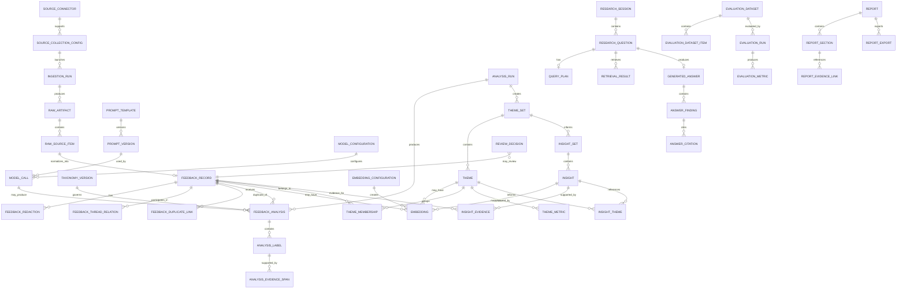

# Data Model: Instamart Discovery Engine

## 1. Purpose

This document defines the canonical data model for the **Instamart Discovery Engine**.

It translates the product requirements in `context.md` and the system boundaries in `architecture.md` into:

- database entities;
- fields and data types;
- primary and foreign keys;
- lifecycle states;
- lineage rules;
- versioning rules;
- integrity constraints;
- indexes;
- vector-storage conventions;
- retention and deletion behaviour;
- migration guidance.

The model is designed for PostgreSQL with the `pgvector` extension.

This document should also be read alongside `design.md` (how these entities are represented to a user), `edgecases.md` (failure and recovery behaviour for this schema, referenced by ID where relevant), and `ai_evals.md` (how evaluation entities defined here are populated and gated).

The governing principle is:

> Every generated theme, insight, answer, score, and report statement must remain traceable to the original collected evidence and to the exact processing configuration that produced it.

---

## 2. Modelling Principles

### 2.1 Preserve raw evidence

Raw source artifacts are immutable. Cleaning, redaction, classification, embedding, clustering, and synthesis produce new records rather than modifying the original source payload.

### 2.2 Separate source truth from derived interpretation

The model distinguishes between:

1. **source facts** — text, rating, date, URL, engagement count;
2. **deterministic transformations** — normalization, hashes, counts, score components;
3. **model-generated interpretation** — labels, theme names, insights, answers;
4. **human-reviewed output** — accepted, edited, rejected, or adjudicated results.

### 2.3 Version all research-producing configuration

Taxonomies, prompts, model settings, embedding models, clustering configurations, scoring profiles, theme sets, insight sets, and evaluation datasets are versioned.

### 2.4 Never overwrite research history

A rerun creates a new version or analysis run. Previous classifications, themes, insights, and answers remain queryable for comparison and audit.

### 2.5 Use explicit relationships

Important evidence relationships should be represented through relational tables rather than hidden inside unvalidated JSON.

JSONB is reserved for:

- source-specific metadata;
- provider response metadata;
- flexible configuration;
- presentation snapshots;
- non-critical extensibility.

### 2.6 Prefer stable internal identifiers

All primary entities use UUIDs. Source-native IDs are retained as external identifiers but are never used as database primary keys.

### 2.7 Database-generated counts are authoritative

Frequency, source distribution, trend, severity, and opportunity-score inputs come from database queries or deterministic code. They are not trusted when returned by an LLM.

---

## 3. PostgreSQL Conventions

### 3.1 Required extensions

```sql
CREATE EXTENSION IF NOT EXISTS pgcrypto;
CREATE EXTENSION IF NOT EXISTS vector;
CREATE EXTENSION IF NOT EXISTS pg_trgm;
CREATE EXTENSION IF NOT EXISTS citext;
```

Optional:

```sql
CREATE EXTENSION IF NOT EXISTS btree_gin;
```

### 3.2 Identifier convention

Primary keys:

```sql
id UUID PRIMARY KEY DEFAULT gen_random_uuid()
```

Foreign keys use the singular entity name followed by `_id`.

Examples:

- `ingestion_run_id`
- `feedback_record_id`
- `taxonomy_version_id`
- `theme_set_id`

### 3.3 Timestamp convention

Use timezone-aware timestamps:

```sql
TIMESTAMPTZ
```

Standard columns:

- `created_at`
- `updated_at`
- `deleted_at` where soft deletion is supported.

Publication dates from sources should be stored separately from ingestion timestamps.

### 3.4 Naming convention

- database names: `snake_case`;
- enum values: lowercase `snake_case`;
- external-provider names: canonical lowercase strings;
- JSON keys: `snake_case`;
- plural table names are not used;
- join tables use both entity names where practical.

### 3.5 Text storage

Use `TEXT` unless a strict length limit is part of the business rule.

Source URLs use `TEXT`, not `VARCHAR(255)`.

### 3.6 Numeric scores

Scores bounded from 0 to 1 use:

```sql
NUMERIC(5,4)
```

Signed sentiment scores use:

```sql
NUMERIC(6,5)
```

Large cost values use:

```sql
NUMERIC(14,6)
```

### 3.7 Soft deletion

Research artifacts use:

```sql
deleted_at TIMESTAMPTZ NULL
```

Raw artifacts and audit records are not soft-deleted casually. They follow a controlled retention or source-removal workflow.

---

## 4. Domain Overview

The database is organized into eight logical domains.

```text
1. Source and collection
2. Canonical feedback
3. Processing and analysis
4. Taxonomy and prompts
5. Embeddings, themes, and insights
6. Research workspace and RAG
7. Validation and human review
8. Reporting, operations, and audit
```

---

## 5. High-Level Entity Relationship Diagram



---

# Part I — Source and Collection Domain

## 6. `source_connector`

Stores the registered connector types supported by the application.

| Column | Type | Required | Description |
|---|---|---:|---|
| `id` | UUID | Yes | Primary key |
| `key` | TEXT | Yes | Stable connector key such as `google_play` |
| `display_name` | TEXT | Yes | Human-readable name |
| `connector_type` | TEXT | Yes | `direct_api`, `library`, `playwright`, `apify`, `rss`, `http` |
| `implementation_version` | TEXT | Yes | Connector code version |
| `is_enabled` | BOOLEAN | Yes | Whether new runs may use it |
| `supports_incremental` | BOOLEAN | Yes | Whether checkpointed collection is supported |
| `supports_thread_context` | BOOLEAN | Yes | Whether thread relationships are available |
| `default_rate_limit_per_minute` | INTEGER | No | Suggested collection throttle |
| `capabilities` | JSONB | Yes | Supported filters and fields |
| `created_at` | TIMESTAMPTZ | Yes | Creation timestamp |
| `updated_at` | TIMESTAMPTZ | Yes | Last update |

Constraints:

```sql
UNIQUE (key);
CHECK (default_rate_limit_per_minute IS NULL OR default_rate_limit_per_minute > 0);
```

Example `capabilities`:

```json
{
  "supports_date_filter": true,
  "supports_rating_filter": true,
  "supports_country_filter": true,
  "supports_replies": false
}
```

---

## 7. `source_collection_config`

Stores reusable source-specific collection configurations.

| Column | Type | Required | Description |
|---|---|---:|---|
| `id` | UUID | Yes | Primary key |
| `source_connector_id` | UUID | Yes | Connector |
| `name` | TEXT | Yes | Configuration label |
| `description` | TEXT | No | Purpose |
| `target_identifier` | TEXT | Yes | App ID, subreddit, URL, or query |
| `configuration` | JSONB | Yes | Source-specific settings |
| `default_record_limit` | INTEGER | No | Default cap |
| `default_date_from` | DATE | No | Optional date lower bound |
| `default_date_to` | DATE | No | Optional date upper bound |
| `is_active` | BOOLEAN | Yes | Whether selectable |
| `created_by_actor_id` | UUID | No | Future user or system actor |
| `created_at` | TIMESTAMPTZ | Yes | Creation timestamp |
| `updated_at` | TIMESTAMPTZ | Yes | Last update |
| `deleted_at` | TIMESTAMPTZ | No | Soft deletion |

Constraints:

```sql
UNIQUE (source_connector_id, name)
WHERE deleted_at IS NULL;

CHECK (default_record_limit IS NULL OR default_record_limit > 0);
CHECK (
  default_date_from IS NULL
  OR default_date_to IS NULL
  OR default_date_from <= default_date_to
);
```

Secrets must not be stored in `configuration`.

---

## 8. `ingestion_run`

Represents one attempt to collect data from one configuration.

| Column | Type | Required | Description |
|---|---|---:|---|
| `id` | UUID | Yes | Primary key |
| `source_collection_config_id` | UUID | Yes | Collection configuration |
| `parent_run_id` | UUID | No | Previous run being resumed or retried |
| `status` | ingestion_run_status | Yes | Run lifecycle |
| `requested_record_limit` | INTEGER | No | Explicit run cap |
| `date_from` | DATE | No | Effective lower bound |
| `date_to` | DATE | No | Effective upper bound |
| `configuration_snapshot` | JSONB | Yes | Immutable effective configuration |
| `checkpoint_start` | JSONB | No | Starting checkpoint |
| `checkpoint_end` | JSONB | No | Ending checkpoint |
| `records_discovered` | INTEGER | Yes | Source items seen |
| `records_stored` | INTEGER | Yes | Raw items stored |
| `records_skipped` | INTEGER | Yes | Skipped items |
| `records_failed` | INTEGER | Yes | Failed items |
| `estimated_cost_usd` | NUMERIC(14,6) | No | Estimated connector cost |
| `actual_cost_usd` | NUMERIC(14,6) | No | Final known cost |
| `started_at` | TIMESTAMPTZ | No | Start time |
| `completed_at` | TIMESTAMPTZ | No | Completion time |
| `failure_code` | TEXT | No | Stable failure category |
| `failure_message` | TEXT | No | Safe failure summary |
| `created_at` | TIMESTAMPTZ | Yes | Creation time |

Enum:

```text
created
queued
running
retrying
partially_completed
completed
failed
cancelled
```

Constraints:

```sql
CHECK (records_discovered >= 0);
CHECK (records_stored >= 0);
CHECK (records_skipped >= 0);
CHECK (records_failed >= 0);
CHECK (requested_record_limit IS NULL OR requested_record_limit > 0);
CHECK (date_from IS NULL OR date_to IS NULL OR date_from <= date_to);
```

Indexes:

```sql
CREATE INDEX idx_ingestion_run_status_created
ON ingestion_run (status, created_at DESC);

CREATE INDEX idx_ingestion_run_config_created
ON ingestion_run (source_collection_config_id, created_at DESC);
```

---

## 9. `raw_artifact`

Represents an immutable response, exported dataset, page capture, or connector payload stored outside PostgreSQL.

| Column | Type | Required | Description |
|---|---|---:|---|
| `id` | UUID | Yes | Primary key |
| `ingestion_run_id` | UUID | Yes | Producing run |
| `storage_backend` | TEXT | Yes | `filesystem`, `s3` |
| `storage_key` | TEXT | Yes | Object path |
| `media_type` | TEXT | Yes | MIME type |
| `byte_size` | BIGINT | No | Stored size |
| `sha256` | CHAR(64) | Yes | Content checksum |
| `source_url` | TEXT | No | Source endpoint or page |
| `http_status` | INTEGER | No | HTTP status when applicable |
| `request_metadata` | JSONB | Yes | Sanitized request metadata |
| `response_metadata` | JSONB | Yes | Sanitized response metadata |
| `captured_at` | TIMESTAMPTZ | Yes | Collection time |
| `retention_expires_at` | TIMESTAMPTZ | No | Scheduled expiry |
| `deleted_at` | TIMESTAMPTZ | No | Controlled removal timestamp |
| `created_at` | TIMESTAMPTZ | Yes | Row creation |

Constraints:

```sql
UNIQUE (storage_backend, storage_key);
CHECK (byte_size IS NULL OR byte_size >= 0);
```

Raw artifact rows are immutable except for retention and deletion metadata.

---

## 10. `raw_source_item`

Represents one source-native record extracted from a raw artifact.

Examples:

- one Google Play review;
- one Reddit post;
- one Reddit comment;
- one web-review entry;
- one industry article passage.

| Column | Type | Required | Description |
|---|---|---:|---|
| `id` | UUID | Yes | Primary key |
| `raw_artifact_id` | UUID | Yes | Parent artifact |
| `ingestion_run_id` | UUID | Yes | Producing run |
| `source_connector_id` | UUID | Yes | Connector used |
| `external_id` | TEXT | Yes | Native source identifier |
| `external_parent_id` | TEXT | No | Parent post or thread ID |
| `record_type` | raw_record_type | Yes | Native record type |
| `source_url` | TEXT | No | Canonical source URL |
| `published_at` | TIMESTAMPTZ | No | Source publication time |
| `edited_at` | TIMESTAMPTZ | No | Source edit time |
| `author_external_id_hash` | CHAR(64) | No | Hashed source author identifier |
| `title` | TEXT | No | Native title |
| `body` | TEXT | No | Native body |
| `rating` | NUMERIC(3,2) | No | Native rating |
| `rating_scale_max` | NUMERIC(3,2) | No | Maximum rating scale |
| `engagement_count` | INTEGER | No | Likes, helpful votes, score |
| `reply_count` | INTEGER | No | Replies where available |
| `language_hint` | TEXT | No | Source-provided language |
| `country_code` | CHAR(2) | No | Source-provided country |
| `app_version` | TEXT | No | App version when available |
| `source_metadata` | JSONB | Yes | Source-specific fields |
| `payload_checksum` | CHAR(64) | Yes | Normalized native payload hash |
| `created_at` | TIMESTAMPTZ | Yes | Creation time |

Enums:

```text
app_review
forum_post
forum_comment
social_post
social_comment
product_review
article_passage
other
```

Constraints:

```sql
UNIQUE (source_connector_id, external_id);
CHECK (rating IS NULL OR rating >= 0);
CHECK (rating_scale_max IS NULL OR rating_scale_max > 0);
CHECK (
  rating IS NULL
  OR rating_scale_max IS NULL
  OR rating <= rating_scale_max
);
CHECK (engagement_count IS NULL OR engagement_count >= 0);
CHECK (reply_count IS NULL OR reply_count >= 0);
```

Indexes:

```sql
CREATE INDEX idx_raw_source_item_published
ON raw_source_item (published_at DESC);

CREATE INDEX idx_raw_source_item_connector
ON raw_source_item (source_connector_id, record_type);

CREATE INDEX idx_raw_source_item_parent
ON raw_source_item (source_connector_id, external_parent_id)
WHERE external_parent_id IS NOT NULL;
```

---

## 11. `connector_checkpoint`

Stores resumable connector state.

| Column | Type | Required | Description |
|---|---|---:|---|
| `id` | UUID | Yes | Primary key |
| `source_collection_config_id` | UUID | Yes | Collection config |
| `ingestion_run_id` | UUID | Yes | Run that produced it |
| `checkpoint_type` | TEXT | Yes | Cursor, page, date, offset |
| `checkpoint_value` | JSONB | Yes | Connector-specific value |
| `is_terminal` | BOOLEAN | Yes | Whether source exhaustion was reached |
| `created_at` | TIMESTAMPTZ | Yes | Creation time |

Indexes:

```sql
CREATE INDEX idx_connector_checkpoint_latest
ON connector_checkpoint (
  source_collection_config_id,
  created_at DESC
);
```

---

# Part II — Canonical Feedback Domain

## 12. `feedback_record`

The central normalized unit of research evidence.

Each eligible `raw_source_item` produces at most one canonical `feedback_record`.

| Column | Type | Required | Description |
|---|---|---:|---|
| `id` | UUID | Yes | Primary key |
| `raw_source_item_id` | UUID | Yes | Source-native record |
| `source_connector_id` | UUID | Yes | Denormalized for efficient filtering |
| `record_type` | raw_record_type | Yes | Canonical record type |
| `source_url` | TEXT | No | Canonical evidence URL |
| `published_at` | TIMESTAMPTZ | No | Publication time |
| `ingested_at` | TIMESTAMPTZ | Yes | First ingestion time |
| `original_title` | TEXT | No | Source title |
| `original_text` | TEXT | Yes | Unchanged source text |
| `normalized_text` | TEXT | Yes | Clean analysis text |
| `redacted_text` | TEXT | Yes | Privacy-safe analysis text |
| `language_code` | TEXT | No | Detected language |
| `language_confidence` | NUMERIC(5,4) | No | Detection confidence |
| `is_code_mixed` | BOOLEAN | Yes | Code-mixed flag |
| `content_hash` | CHAR(64) | Yes | Exact duplicate hash |
| `normalized_length` | INTEGER | Yes | Character count |
| `token_estimate` | INTEGER | No | Approximate token count |
| `rating_normalized` | NUMERIC(5,4) | No | Rating mapped to 0–1 |
| `engagement_count` | INTEGER | No | Source engagement |
| `country_code` | CHAR(2) | No | Explicit source geography |
| `app_version` | TEXT | No | Source app version |
| `relevance_status` | relevance_status | Yes | Research relevance |
| `quality_status` | quality_status | Yes | Processing quality |
| `processing_status` | feedback_processing_status | Yes | Lifecycle stage |
| `is_primary_for_counts` | BOOLEAN | Yes | Excludes duplicates by default |
| `is_deleted_at_source` | BOOLEAN | Yes | Source deletion observed |
| `source_deleted_at` | TIMESTAMPTZ | No | Source deletion time |
| `created_at` | TIMESTAMPTZ | Yes | Creation time |
| `updated_at` | TIMESTAMPTZ | Yes | Last update |
| `deleted_at` | TIMESTAMPTZ | No | Controlled soft deletion |

Relevance enum:

```text
unreviewed
relevant_user_feedback
relevant_competitor_feedback
industry_commentary
irrelevant
spam_or_promotion
insufficient_content
```

Quality enum:

```text
unassessed
usable
low_information
malformed
unsupported_language
privacy_blocked
collection_incomplete
```

Processing enum:

```text
collected
normalized
redacted
relevance_assessed
deduplicated
classified
embedded
themed
insight_linked
reviewed
failed
```

Constraints:

```sql
UNIQUE (raw_source_item_id);
CHECK (normalized_length >= 0);
CHECK (token_estimate IS NULL OR token_estimate >= 0);
CHECK (
  rating_normalized IS NULL
  OR rating_normalized BETWEEN 0 AND 1
);
CHECK (
  language_confidence IS NULL
  OR language_confidence BETWEEN 0 AND 1
);
```

Recommended indexes:

```sql
CREATE INDEX idx_feedback_record_filter
ON feedback_record (
  relevance_status,
  quality_status,
  is_primary_for_counts,
  published_at DESC
)
WHERE deleted_at IS NULL;

CREATE INDEX idx_feedback_record_source_date
ON feedback_record (
  source_connector_id,
  published_at DESC
)
WHERE deleted_at IS NULL;

CREATE INDEX idx_feedback_record_content_hash
ON feedback_record (content_hash);

CREATE INDEX idx_feedback_record_text_trgm
ON feedback_record
USING GIN (redacted_text gin_trgm_ops);

CREATE INDEX idx_feedback_record_fts
ON feedback_record
USING GIN (
  to_tsvector('simple', coalesce(original_title, '') || ' ' || redacted_text)
);
```

---

## 13. `feedback_thread_relation`

Represents conversational structure without duplicating source content.

| Column | Type | Required | Description |
|---|---|---:|---|
| `id` | UUID | Yes | Primary key |
| `parent_feedback_record_id` | UUID | Yes | Parent record |
| `child_feedback_record_id` | UUID | Yes | Child record |
| `relation_type` | thread_relation_type | Yes | Relation |
| `depth` | INTEGER | No | Thread depth |
| `position_in_thread` | INTEGER | No | Source order |
| `created_at` | TIMESTAMPTZ | Yes | Creation time |

Enum:

```text
reply_to
comment_on
quoted_by
context_for
```

Constraints:

```sql
UNIQUE (
  parent_feedback_record_id,
  child_feedback_record_id,
  relation_type
);

CHECK (parent_feedback_record_id <> child_feedback_record_id);
CHECK (depth IS NULL OR depth >= 0);
```

---

## 14. `feedback_duplicate_link`

Represents exact or near-duplicate relationships.

| Column | Type | Required | Description |
|---|---|---:|---|
| `id` | UUID | Yes | Primary key |
| `canonical_feedback_record_id` | UUID | Yes | Record retained for counts |
| `duplicate_feedback_record_id` | UUID | Yes | Duplicate record |
| `duplicate_type` | duplicate_type | Yes | Exact or near duplicate |
| `lexical_similarity` | NUMERIC(5,4) | No | Lexical score |
| `semantic_similarity` | NUMERIC(5,4) | No | Embedding score |
| `decision_method` | TEXT | Yes | Rule, model, human |
| `decision_version` | TEXT | Yes | Algorithm or rule version |
| `created_at` | TIMESTAMPTZ | Yes | Creation time |

Enum:

```text
exact
near_duplicate
cross_source_repost
quoted_copy
```

Constraints:

```sql
UNIQUE (duplicate_feedback_record_id);
CHECK (canonical_feedback_record_id <> duplicate_feedback_record_id);
CHECK (
  lexical_similarity IS NULL
  OR lexical_similarity BETWEEN 0 AND 1
);
CHECK (
  semantic_similarity IS NULL
  OR semantic_similarity BETWEEN 0 AND 1
);
```

When a duplicate link is accepted:

```text
duplicate feedback_record.is_primary_for_counts = false
```

---

## 15. `feedback_redaction`

Stores privacy-redaction events without exposing the original sensitive value.

| Column | Type | Required | Description |
|---|---|---:|---|
| `id` | UUID | Yes | Primary key |
| `feedback_record_id` | UUID | Yes | Affected record |
| `redaction_type` | redaction_type | Yes | PII type |
| `start_offset_original` | INTEGER | No | Original text start |
| `end_offset_original` | INTEGER | No | Original text end |
| `replacement_token` | TEXT | Yes | Example `[PHONE]` |
| `detector` | TEXT | Yes | Rule or model |
| `detector_version` | TEXT | Yes | Detector version |
| `confidence` | NUMERIC(5,4) | No | Detection confidence |
| `created_at` | TIMESTAMPTZ | Yes | Creation time |

Enum:

```text
email
phone
address
order_id
payment_identifier
person_name
username
other
```

The original sensitive substring is not stored in this table.

---

## 16. `feedback_quality_event`

Stores quality checks and processing warnings.

| Column | Type | Required | Description |
|---|---|---:|---|
| `id` | UUID | Yes | Primary key |
| `feedback_record_id` | UUID | Yes | Affected record |
| `event_type` | TEXT | Yes | Quality event |
| `severity` | quality_event_severity | Yes | Warning level |
| `stage` | TEXT | Yes | Processing stage |
| `message` | TEXT | Yes | Safe explanation |
| `details` | JSONB | Yes | Structured details |
| `created_at` | TIMESTAMPTZ | Yes | Creation time |

Enum:

```text
info
warning
error
```

---

# Part III — Runs, Taxonomy, Prompts, and AI Audit

## 17. `analysis_run`

Represents a versioned pipeline execution over a dataset snapshot.

| Column | Type | Required | Description |
|---|---|---:|---|
| `id` | UUID | Yes | Primary key |
| `name` | TEXT | Yes | Human-readable label |
| `parent_analysis_run_id` | UUID | No | Retry or derivative run |
| `status` | analysis_run_status | Yes | Lifecycle |
| `dataset_snapshot` | JSONB | Yes | Included ingestion runs, dates, filters |
| `taxonomy_version_id` | UUID | Yes | Taxonomy used |
| `embedding_configuration_id` | UUID | Yes | Embedding config |
| `classification_model_configuration_id` | UUID | Yes | Classification model |
| `theme_model_configuration_id` | UUID | No | Theme synthesis model |
| `insight_model_configuration_id` | UUID | No | Insight model |
| `clustering_configuration` | JSONB | Yes | Algorithm and parameters |
| `scoring_profile_id` | UUID | No | Opportunity scoring profile |
| `records_selected` | INTEGER | Yes | Eligible records |
| `records_classified` | INTEGER | Yes | Completed classifications |
| `records_embedded` | INTEGER | Yes | Completed embeddings |
| `records_failed` | INTEGER | Yes | Failed records |
| `started_at` | TIMESTAMPTZ | No | Start time |
| `completed_at` | TIMESTAMPTZ | No | Completion time |
| `failure_code` | TEXT | No | Failure category |
| `failure_message` | TEXT | No | Safe failure message |
| `created_at` | TIMESTAMPTZ | Yes | Creation time |

Enum:

```text
created
queued
running
retrying
partially_completed
completed
failed
cancelled
```

Constraints:

```sql
CHECK (records_selected >= 0);
CHECK (records_classified >= 0);
CHECK (records_embedded >= 0);
CHECK (records_failed >= 0);
```

---

## 18. `taxonomy_version`

Stores an immutable taxonomy release.

| Column | Type | Required | Description |
|---|---|---:|---|
| `id` | UUID | Yes | Primary key |
| `version_key` | TEXT | Yes | Example `2026-07-v1` |
| `name` | TEXT | Yes | Human-readable name |
| `description` | TEXT | No | Scope |
| `schema_definition` | JSONB | Yes | Canonical taxonomy definition |
| `source_file_checksum` | CHAR(64) | Yes | Config checksum |
| `status` | taxonomy_status | Yes | Draft or published |
| `published_at` | TIMESTAMPTZ | No | Publication time |
| `created_at` | TIMESTAMPTZ | Yes | Creation time |

Enum:

```text
draft
published
deprecated
```

Constraints:

```sql
UNIQUE (version_key);
```

Published taxonomy versions are immutable.

---

## 19. `taxonomy_dimension`

Stores queryable dimensions contained within a taxonomy version.

Examples:

- `journey_stage`
- `behavioural_driver`
- `exploration_barrier`
- `frustration`
- `unmet_need`
- `experimentation_signal`
- `sentiment`
- `severity`

| Column | Type | Required | Description |
|---|---|---:|---|
| `id` | UUID | Yes | Primary key |
| `taxonomy_version_id` | UUID | Yes | Parent taxonomy |
| `key` | TEXT | Yes | Stable dimension key |
| `display_name` | TEXT | Yes | UI name |
| `description` | TEXT | Yes | Classification definition |
| `cardinality` | taxonomy_cardinality | Yes | Single or multi-label |
| `value_type` | taxonomy_value_type | Yes | Label, ordinal, numeric |
| `sort_order` | INTEGER | Yes | UI order |
| `created_at` | TIMESTAMPTZ | Yes | Creation time |

Enums:

```text
single
multiple
```

```text
categorical
ordinal
numeric
boolean
```

Constraints:

```sql
UNIQUE (taxonomy_version_id, key);
```

---

## 20. `taxonomy_label`

Stores the allowed label vocabulary.

| Column | Type | Required | Description |
|---|---|---:|---|
| `id` | UUID | Yes | Primary key |
| `taxonomy_dimension_id` | UUID | Yes | Parent dimension |
| `key` | TEXT | Yes | Stable label key |
| `display_name` | TEXT | Yes | UI name |
| `definition` | TEXT | Yes | Inclusion definition |
| `inclusion_examples` | JSONB | Yes | Examples |
| `exclusion_examples` | JSONB | Yes | Counterexamples |
| `parent_label_id` | UUID | No | Optional hierarchy |
| `is_active` | BOOLEAN | Yes | Active in this version |
| `sort_order` | INTEGER | Yes | UI order |
| `created_at` | TIMESTAMPTZ | Yes | Creation time |

Constraints:

```sql
UNIQUE (taxonomy_dimension_id, key);
```

---

## 21. `prompt_template`

Represents a logical prompt task.

| Column | Type | Required | Description |
|---|---|---:|---|
| `id` | UUID | Yes | Primary key |
| `task_key` | TEXT | Yes | Example `feedback_classification` |
| `name` | TEXT | Yes | Human-readable name |
| `description` | TEXT | No | Task purpose |
| `input_schema_key` | TEXT | No | Pydantic schema identifier |
| `output_schema_key` | TEXT | No | Pydantic schema identifier |
| `created_at` | TIMESTAMPTZ | Yes | Creation time |

Constraint:

```sql
UNIQUE (task_key);
```

---

## 22. `prompt_version`

Stores immutable prompt versions.

| Column | Type | Required | Description |
|---|---|---:|---|
| `id` | UUID | Yes | Primary key |
| `prompt_template_id` | UUID | Yes | Logical prompt |
| `version_key` | TEXT | Yes | Semantic or date version |
| `system_prompt` | TEXT | Yes | System instruction |
| `user_prompt_template` | TEXT | Yes | Templated user content |
| `response_schema` | JSONB | No | JSON schema snapshot |
| `source_file_checksum` | CHAR(64) | Yes | Version control checksum |
| `status` | prompt_status | Yes | Draft or published |
| `published_at` | TIMESTAMPTZ | No | Publication time |
| `created_at` | TIMESTAMPTZ | Yes | Creation time |

Enum:

```text
draft
published
deprecated
```

Constraint:

```sql
UNIQUE (prompt_template_id, version_key);
```

---

## 23. `model_configuration`

Stores reusable LLM configurations.

| Column | Type | Required | Description |
|---|---|---:|---|
| `id` | UUID | Yes | Primary key |
| `name` | TEXT | Yes | Configuration name |
| `provider` | TEXT | Yes | Example `anthropic` |
| `model_name` | TEXT | Yes | Provider model identifier |
| `task_type` | TEXT | Yes | Classification, synthesis, answer |
| `temperature` | NUMERIC(4,3) | No | Sampling temperature |
| `max_output_tokens` | INTEGER | No | Output cap |
| `timeout_seconds` | INTEGER | Yes | Request timeout |
| `max_retries` | INTEGER | Yes | Retry limit |
| `structured_output_mode` | TEXT | Yes | Tool, JSON schema, parser |
| `configuration` | JSONB | Yes | Additional safe settings |
| `is_active` | BOOLEAN | Yes | Selectable |
| `created_at` | TIMESTAMPTZ | Yes | Creation time |
| `updated_at` | TIMESTAMPTZ | Yes | Last update |

Constraints:

```sql
CHECK (temperature IS NULL OR temperature BETWEEN 0 AND 2);
CHECK (max_output_tokens IS NULL OR max_output_tokens > 0);
CHECK (timeout_seconds > 0);
CHECK (max_retries >= 0);
```

API keys are never stored here.

---

## 24. `model_call`

The authoritative audit record for every LLM call.

| Column | Type | Required | Description |
|---|---|---:|---|
| `id` | UUID | Yes | Primary key |
| `analysis_run_id` | UUID | No | Related analysis run |
| `research_question_id` | UUID | No | Related question |
| `prompt_version_id` | UUID | Yes | Prompt used |
| `model_configuration_id` | UUID | Yes | Model settings |
| `task_type` | TEXT | Yes | Logical task |
| `status` | model_call_status | Yes | Call status |
| `input_object_type` | TEXT | No | Feedback, theme, insight, query |
| `input_object_ids` | UUID[] | No | Referenced entity IDs |
| `input_checksum` | CHAR(64) | Yes | Canonical input checksum |
| `request_payload_redacted` | JSONB | Yes | Safe request metadata |
| `raw_response` | JSONB | No | Raw structured provider response |
| `parsed_response` | JSONB | No | Validated response |
| `provider_request_id` | TEXT | No | Provider trace ID |
| `input_tokens` | INTEGER | No | Usage |
| `output_tokens` | INTEGER | No | Usage |
| `latency_ms` | INTEGER | No | Duration |
| `retry_count` | INTEGER | Yes | Retry number |
| `estimated_cost_usd` | NUMERIC(14,6) | No | Estimated cost |
| `error_code` | TEXT | No | Stable failure |
| `error_message` | TEXT | No | Safe error |
| `started_at` | TIMESTAMPTZ | Yes | Start time |
| `completed_at` | TIMESTAMPTZ | No | Completion time |
| `created_at` | TIMESTAMPTZ | Yes | Creation time |

Enum:

```text
queued
running
succeeded
invalid_output
rate_limited
timed_out
failed
cancelled
```

Indexes:

```sql
CREATE INDEX idx_model_call_run_task
ON model_call (analysis_run_id, task_type, created_at DESC);

CREATE INDEX idx_model_call_status
ON model_call (status, created_at DESC);
```

---

# Part IV — Classification Domain

## 25. `feedback_analysis`

Represents one complete structured analysis of one feedback record.

| Column | Type | Required | Description |
|---|---|---:|---|
| `id` | UUID | Yes | Primary key |
| `feedback_record_id` | UUID | Yes | Analyzed record |
| `analysis_run_id` | UUID | Yes | Producing run |
| `taxonomy_version_id` | UUID | Yes | Taxonomy |
| `model_call_id` | UUID | No | Producing model call |
| `status` | feedback_analysis_status | Yes | Analysis state |
| `overall_confidence` | NUMERIC(5,4) | No | Overall confidence |
| `sentiment_score` | NUMERIC(6,5) | No | Signed sentiment |
| `sentiment_confidence` | NUMERIC(5,4) | No | Sentiment confidence |
| `severity_value` | SMALLINT | No | Ordinal severity |
| `severity_confidence` | NUMERIC(5,4) | No | Severity confidence |
| `summary` | TEXT | No | Short model summary |
| `is_human_corrected` | BOOLEAN | Yes | Human correction flag |
| `supersedes_feedback_analysis_id` | UUID | No | Previous corrected analysis |
| `created_at` | TIMESTAMPTZ | Yes | Creation time |
| `updated_at` | TIMESTAMPTZ | Yes | Last update |

Enum:

```text
pending
succeeded
low_confidence
invalid_output
failed
human_corrected
```

Constraints:

```sql
UNIQUE (feedback_record_id, analysis_run_id);

CHECK (
  overall_confidence IS NULL
  OR overall_confidence BETWEEN 0 AND 1
);

CHECK (
  sentiment_score IS NULL
  OR sentiment_score BETWEEN -1 AND 1
);

CHECK (
  severity_value IS NULL
  OR severity_value BETWEEN 0 AND 5
);
```

---

## 26. `analysis_label`

Stores one applied taxonomy label.

| Column | Type | Required | Description |
|---|---|---:|---|
| `id` | UUID | Yes | Primary key |
| `feedback_analysis_id` | UUID | Yes | Parent analysis |
| `taxonomy_dimension_id` | UUID | Yes | Dimension |
| `taxonomy_label_id` | UUID | Yes | Label |
| `confidence` | NUMERIC(5,4) | Yes | Label confidence |
| `source` | label_source | Yes | Model, rule, human |
| `review_status` | review_status | Yes | Review lifecycle |
| `created_at` | TIMESTAMPTZ | Yes | Creation time |
| `updated_at` | TIMESTAMPTZ | Yes | Last update |

Enums:

```text
model
rule
human
imported
```

```text
unreviewed
accepted
edited
rejected
needs_second_review
```

Constraints:

```sql
UNIQUE (
  feedback_analysis_id,
  taxonomy_label_id,
  source
);

CHECK (confidence BETWEEN 0 AND 1);
```

---

## 27. `analysis_evidence_span`

Stores the exact excerpt supporting a label or classification.

| Column | Type | Required | Description |
|---|---|---:|---|
| `id` | UUID | Yes | Primary key |
| `analysis_label_id` | UUID | Yes | Supported label |
| `feedback_record_id` | UUID | Yes | Evidence record |
| `text_variant` | text_variant | Yes | Original, normalized, redacted |
| `start_offset` | INTEGER | Yes | Inclusive character offset |
| `end_offset` | INTEGER | Yes | Exclusive character offset |
| `excerpt_snapshot` | TEXT | Yes | Immutable displayed excerpt |
| `support_strength` | NUMERIC(5,4) | No | Support score |
| `created_at` | TIMESTAMPTZ | Yes | Creation time |

Enum:

```text
original
normalized
redacted
```

Constraints:

```sql
CHECK (start_offset >= 0);
CHECK (end_offset > start_offset);
CHECK (
  support_strength IS NULL
  OR support_strength BETWEEN 0 AND 1
);
```

The application must verify offsets against the selected text variant before insertion.

---

# Part V — Embeddings and Semantic Index

## 28. `embedding_configuration`

Stores immutable embedding-model configurations.

| Column | Type | Required | Description |
|---|---|---:|---|
| `id` | UUID | Yes | Primary key |
| `version_key` | TEXT | Yes | Stable embedding version |
| `provider` | TEXT | Yes | Local or hosted provider |
| `model_name` | TEXT | Yes | Embedding model |
| `dimension` | INTEGER | Yes | Vector dimension |
| `distance_metric` | TEXT | Yes | Cosine, inner product, L2 |
| `max_input_tokens` | INTEGER | No | Input limit |
| `normalization_strategy` | TEXT | Yes | Text preparation strategy |
| `configuration` | JSONB | Yes | Safe additional configuration |
| `is_active` | BOOLEAN | Yes | Active for new runs |
| `created_at` | TIMESTAMPTZ | Yes | Creation time |

Constraints:

```sql
UNIQUE (version_key);
CHECK (dimension > 0);
CHECK (max_input_tokens IS NULL OR max_input_tokens > 0);
```

---

## 29. `embedding`

Stores vectors for supported object types.

The physical vector column dimension must match the configured production embedding dimension. When supporting multiple dimensions, use separate tables or migrations rather than an unconstrained design.

| Column | Type | Required | Description |
|---|---|---:|---|
| `id` | UUID | Yes | Primary key |
| `embedding_configuration_id` | UUID | Yes | Embedding config |
| `object_type` | embedding_object_type | Yes | Entity type |
| `object_id` | UUID | Yes | Entity identifier |
| `text_variant` | TEXT | Yes | Text source |
| `text_checksum` | CHAR(64) | Yes | Embedded text hash |
| `embedding_vector` | VECTOR(n) | Yes | pgvector value |
| `token_count` | INTEGER | No | Embedded token count |
| `created_at` | TIMESTAMPTZ | Yes | Creation time |

Enum:

```text
feedback_record
feedback_context_window
theme
insight
research_question
```

Constraints:

```sql
UNIQUE (
  embedding_configuration_id,
  object_type,
  object_id,
  text_checksum
);

CHECK (token_count IS NULL OR token_count >= 0);
```

Because PostgreSQL cannot enforce a polymorphic foreign key, application services must validate `object_type` and `object_id`.

Indexes are selected after volume testing.

Example cosine index:

```sql
CREATE INDEX idx_embedding_vector_hnsw
ON embedding
USING hnsw (embedding_vector vector_cosine_ops);
```

---

# Part VI — Themes and Insights

## 30. `theme_set`

A versioned set of themes created from one analysis run and clustering configuration.

| Column | Type | Required | Description |
|---|---|---:|---|
| `id` | UUID | Yes | Primary key |
| `analysis_run_id` | UUID | Yes | Producing analysis |
| `version_number` | INTEGER | Yes | Version within run |
| `name` | TEXT | Yes | Theme-set name |
| `status` | theme_set_status | Yes | Lifecycle |
| `clustering_algorithm` | TEXT | Yes | HDBSCAN, KMeans, hybrid |
| `clustering_configuration` | JSONB | Yes | Immutable parameters |
| `eligible_record_count` | INTEGER | Yes | Input count |
| `clustered_record_count` | INTEGER | Yes | Assigned count |
| `outlier_record_count` | INTEGER | Yes | Outlier count |
| `theme_count` | INTEGER | Yes | Theme total |
| `coverage_score` | NUMERIC(5,4) | No | Cluster coverage |
| `stability_score` | NUMERIC(5,4) | No | Run stability |
| `published_at` | TIMESTAMPTZ | No | Publication time |
| `created_at` | TIMESTAMPTZ | Yes | Creation time |

Enum:

```text
draft
processing
ready_for_review
published
rejected
superseded
```

Constraints:

```sql
UNIQUE (analysis_run_id, version_number);
CHECK (version_number > 0);
CHECK (eligible_record_count >= 0);
CHECK (clustered_record_count >= 0);
CHECK (outlier_record_count >= 0);
CHECK (theme_count >= 0);
```

---

## 31. `theme`

Represents one coherent theme.

| Column | Type | Required | Description |
|---|---|---:|---|
| `id` | UUID | Yes | Primary key |
| `theme_set_id` | UUID | Yes | Parent theme set |
| `theme_key` | TEXT | Yes | Stable key within set |
| `name` | TEXT | Yes | Human-readable theme name |
| `short_summary` | TEXT | Yes | Brief description |
| `long_summary` | TEXT | No | Detailed synthesis |
| `theme_type` | theme_type | Yes | Discovery domain |
| `status` | theme_status | Yes | Review state |
| `model_call_id` | UUID | No | Theme naming call |
| `representative_record_count` | INTEGER | Yes | Evidence count |
| `confidence_score` | NUMERIC(5,4) | No | Overall confidence |
| `coherence_score` | NUMERIC(5,4) | No | Internal coherence |
| `discovery_relevance_score` | NUMERIC(5,4) | No | Relevance to problem |
| `actionability_score` | NUMERIC(5,4) | No | Product actionability |
| `opportunity_score` | NUMERIC(8,4) | No | Denormalized deterministic ranking score |
| `score_components` | JSONB | Yes | Component snapshot backing `opportunity_score` |
| `created_at` | TIMESTAMPTZ | Yes | Creation time |
| `updated_at` | TIMESTAMPTZ | Yes | Last update |
| `deleted_at` | TIMESTAMPTZ | No | Soft deletion |

Theme types:

```text
repeat_category_driver
exploration_barrier
discovery_mechanism
habit_signal
information_need
frustration
experimentation_signal
unmet_need
service_quality
other
```

Theme statuses:

```text
unreviewed
accepted
edited
rejected
merged
split
superseded
```

Constraints:

```sql
UNIQUE (theme_set_id, theme_key);

CHECK (
  confidence_score IS NULL
  OR confidence_score BETWEEN 0 AND 1
);

CHECK (
  coherence_score IS NULL
  OR coherence_score BETWEEN 0 AND 1
);

CHECK (
  opportunity_score IS NULL
  OR opportunity_score >= 0
);
```

`opportunity_score` is written by the same deterministic scoring service that produces `insight.opportunity_score`. The versioned component breakdown remains available through `theme_metric` (`metric_key = opportunity_score`) for audit and recalculation history; this column is a denormalized cache for sorting and display.

---

## 32. `theme_membership`

Links records to themes.

| Column | Type | Required | Description |
|---|---|---:|---|
| `id` | UUID | Yes | Primary key |
| `theme_id` | UUID | Yes | Theme |
| `feedback_record_id` | UUID | Yes | Member record |
| `membership_score` | NUMERIC(5,4) | Yes | Membership confidence |
| `assignment_method` | TEXT | Yes | Cluster, classifier, human |
| `is_representative` | BOOLEAN | Yes | Representative evidence |
| `is_counterexample` | BOOLEAN | Yes | Contradictory evidence |
| `rank_within_theme` | INTEGER | No | Evidence rank |
| `review_status` | review_status | Yes | Review state |
| `created_at` | TIMESTAMPTZ | Yes | Creation time |
| `updated_at` | TIMESTAMPTZ | Yes | Last update |

Constraints:

```sql
UNIQUE (theme_id, feedback_record_id);
CHECK (membership_score BETWEEN 0 AND 1);
CHECK (rank_within_theme IS NULL OR rank_within_theme > 0);
CHECK (NOT (is_representative AND is_counterexample));
```

Indexes:

```sql
CREATE INDEX idx_theme_membership_record
ON theme_membership (feedback_record_id, theme_id);

CREATE INDEX idx_theme_membership_rank
ON theme_membership (
  theme_id,
  is_representative DESC,
  rank_within_theme
);
```

---

## 33. `theme_metric`

Stores deterministic theme metrics by metric key and optional segment.

| Column | Type | Required | Description |
|---|---|---:|---|
| `id` | UUID | Yes | Primary key |
| `theme_id` | UUID | Yes | Theme |
| `metric_key` | TEXT | Yes | Example `record_count` |
| `segment_key` | TEXT | No | Example `source=reddit` |
| `numeric_value` | NUMERIC(20,6) | No | Numeric metric |
| `text_value` | TEXT | No | Text metric |
| `json_value` | JSONB | No | Structured distribution |
| `calculation_version` | TEXT | Yes | Metric logic version |
| `calculated_at` | TIMESTAMPTZ | Yes | Calculation time |

Constraints:

```sql
UNIQUE (theme_id, metric_key, segment_key, calculation_version);

CHECK (
  num_nonnulls(numeric_value, text_value, json_value) = 1
);
```

Common keys:

```text
record_count
record_share
source_distribution
rating_distribution
sentiment_distribution
severity_distribution
publication_trend
category_distribution
journey_stage_distribution
source_breadth
coherence_score
confidence_score
discovery_relevance_score
actionability_score
opportunity_score
```

---

## 34. `scoring_profile`

Stores versioned opportunity-score weights.

| Column | Type | Required | Description |
|---|---|---:|---|
| `id` | UUID | Yes | Primary key |
| `version_key` | TEXT | Yes | Stable version |
| `name` | TEXT | Yes | Human-readable name |
| `description` | TEXT | No | Scoring purpose |
| `weights` | JSONB | Yes | Component weights |
| `normalization_rules` | JSONB | Yes | Input normalization |
| `formula_expression` | TEXT | Yes | Human-readable formula |
| `status` | scoring_profile_status | Yes | Draft or published |
| `created_at` | TIMESTAMPTZ | Yes | Creation time |
| `published_at` | TIMESTAMPTZ | No | Publication time |

Enum:

```text
draft
published
deprecated
```

Constraint:

```sql
UNIQUE (version_key);
```

The service must validate that published weights sum to the configured expected total.

---

## 35. `insight_set`

Groups insights produced from a specific theme set.

| Column | Type | Required | Description |
|---|---|---:|---|
| `id` | UUID | Yes | Primary key |
| `theme_set_id` | UUID | Yes | Source theme set |
| `analysis_run_id` | UUID | Yes | Producing analysis |
| `version_number` | INTEGER | Yes | Version |
| `status` | insight_set_status | Yes | Lifecycle |
| `model_configuration_id` | UUID | Yes | Synthesis model |
| `prompt_version_id` | UUID | Yes | Prompt version |
| `insight_count` | INTEGER | Yes | Number created |
| `published_at` | TIMESTAMPTZ | No | Publication time |
| `created_at` | TIMESTAMPTZ | Yes | Creation time |

Enum:

```text
draft
processing
ready_for_review
published
rejected
superseded
```

Constraints:

```sql
UNIQUE (theme_set_id, version_number);
CHECK (version_number > 0);
CHECK (insight_count >= 0);
```

---

## 36. `insight`

Represents an evidence-backed research insight.

| Column | Type | Required | Description |
|---|---|---:|---|
| `id` | UUID | Yes | Primary key |
| `insight_set_id` | UUID | Yes | Parent set |
| `insight_type` | insight_type | Yes | Evidence class |
| `title` | TEXT | Yes | Insight headline |
| `finding` | TEXT | Yes | What was observed |
| `interpretation` | TEXT | Yes | Meaning of the finding |
| `affected_context` | TEXT | No | Segment or context |
| `product_implication` | TEXT | No | Potential product relevance |
| `validation_recommendation` | TEXT | No | How to validate |
| `confidence_level` | confidence_level | Yes | Low, medium, high |
| `confidence_score` | NUMERIC(5,4) | No | Numeric confidence |
| `opportunity_score` | NUMERIC(8,4) | No | Deterministic score |
| `score_components` | JSONB | Yes | Component snapshot |
| `model_call_id` | UUID | No | Producing call |
| `status` | review_status | Yes | Review state |
| `supersedes_insight_id` | UUID | No | Edited prior insight |
| `created_at` | TIMESTAMPTZ | Yes | Creation time |
| `updated_at` | TIMESTAMPTZ | Yes | Last update |
| `deleted_at` | TIMESTAMPTZ | No | Soft deletion |

Insight type:

```text
observed_evidence
synthesized_insight
product_hypothesis
```

Confidence:

```text
low
medium
high
```

Constraints:

```sql
CHECK (
  confidence_score IS NULL
  OR confidence_score BETWEEN 0 AND 1
);

CHECK (
  opportunity_score IS NULL
  OR opportunity_score >= 0
);
```

---

## 37. `insight_theme`

Links insights to the themes that informed them.

| Column | Type | Required | Description |
|---|---|---:|---|
| `id` | UUID | Yes | Primary key |
| `insight_id` | UUID | Yes | Insight |
| `theme_id` | UUID | Yes | Theme |
| `relationship_type` | insight_theme_relationship | Yes | Role |
| `relevance_score` | NUMERIC(5,4) | No | Relevance |
| `created_at` | TIMESTAMPTZ | Yes | Creation time |

Enum:

```text
primary
supporting
contradictory
contextual
```

Constraints:

```sql
UNIQUE (insight_id, theme_id, relationship_type);
CHECK (
  relevance_score IS NULL
  OR relevance_score BETWEEN 0 AND 1
);
```

---

## 38. `insight_evidence`

Links insights directly to evidence records.

| Column | Type | Required | Description |
|---|---|---:|---|
| `id` | UUID | Yes | Primary key |
| `insight_id` | UUID | Yes | Insight |
| `feedback_record_id` | UUID | Yes | Evidence record |
| `evidence_role` | evidence_role | Yes | Support type |
| `relevance_score` | NUMERIC(5,4) | Yes | Evidence relevance |
| `start_offset` | INTEGER | No | Excerpt start |
| `end_offset` | INTEGER | No | Excerpt end |
| `excerpt_snapshot` | TEXT | Yes | Immutable excerpt |
| `review_status` | review_status | Yes | Review state |
| `created_at` | TIMESTAMPTZ | Yes | Creation time |
| `updated_at` | TIMESTAMPTZ | Yes | Last update |

Evidence role:

```text
supporting
contradictory
illustrative
quantitative_context
```

Constraints:

```sql
UNIQUE (
  insight_id,
  feedback_record_id,
  evidence_role
);

CHECK (relevance_score BETWEEN 0 AND 1);

CHECK (
  (start_offset IS NULL AND end_offset IS NULL)
  OR
  (start_offset >= 0 AND end_offset > start_offset)
);
```

---

# Part VII — Research Workspace and RAG

## 39. `research_session`

Represents a user's research workspace or conversation.

| Column | Type | Required | Description |
|---|---|---:|---|
| `id` | UUID | Yes | Primary key |
| `title` | TEXT | Yes | Session title |
| `actor_id` | UUID | No | Future user ID |
| `analysis_run_id` | UUID | Yes | Dataset and analysis context |
| `theme_set_id` | UUID | Yes | Theme version |
| `insight_set_id` | UUID | No | Insight version |
| `default_filters` | JSONB | Yes | Session filters |
| `status` | research_session_status | Yes | Active or archived |
| `created_at` | TIMESTAMPTZ | Yes | Creation time |
| `updated_at` | TIMESTAMPTZ | Yes | Last update |
| `deleted_at` | TIMESTAMPTZ | No | Soft deletion |

Enum:

```text
active
archived
```

---

## 40. `research_question`

Stores one natural-language research question.

| Column | Type | Required | Description |
|---|---|---:|---|
| `id` | UUID | Yes | Primary key |
| `research_session_id` | UUID | Yes | Parent session |
| `parent_question_id` | UUID | No | Follow-up question |
| `question_text` | TEXT | Yes | User question |
| `status` | research_question_status | Yes | Processing state |
| `requested_filters` | JSONB | Yes | Explicit filters |
| `effective_filters` | JSONB | Yes | Validated filters |
| `answer_mode` | TEXT | Yes | Explanation, count, comparison |
| `started_at` | TIMESTAMPTZ | No | Processing start |
| `completed_at` | TIMESTAMPTZ | No | Completion |
| `failure_code` | TEXT | No | Failure category |
| `failure_message` | TEXT | No | Safe error |
| `created_at` | TIMESTAMPTZ | Yes | Creation time |

Enum:

```text
created
planning
retrieving
generating
validating
completed
completed_with_warnings
failed
cancelled
```

Indexes:

```sql
CREATE INDEX idx_research_question_session_created
ON research_question (
  research_session_id,
  created_at
);
```

---

## 41. `query_plan`

Stores the validated structured interpretation of a research question.

| Column | Type | Required | Description |
|---|---|---:|---|
| `id` | UUID | Yes | Primary key |
| `research_question_id` | UUID | Yes | Question |
| `model_call_id` | UUID | No | Planner call |
| `research_dimensions` | TEXT[] | Yes | Parsed dimensions |
| `query_intent` | query_intent | Yes | Count, compare, explain |
| `structured_filters` | JSONB | Yes | Source, date, taxonomy filters |
| `retrieval_strategy` | JSONB | Yes | Hybrid retrieval parameters |
| `ambiguity_warnings` | JSONB | Yes | Detected ambiguities |
| `requires_deterministic_aggregation` | BOOLEAN | Yes | Count query flag |
| `created_at` | TIMESTAMPTZ | Yes | Creation time |

Query intent:

```text
explain
count
compare
rank
find_examples
summarize
validate_hypothesis
```

Constraint:

```sql
UNIQUE (research_question_id);
```

---

## 42. `retrieval_result`

Stores each candidate evidence object considered for an answer.

| Column | Type | Required | Description |
|---|---|---:|---|
| `id` | UUID | Yes | Primary key |
| `research_question_id` | UUID | Yes | Question |
| `object_type` | retrieval_object_type | Yes | Evidence entity type |
| `object_id` | UUID | Yes | Entity ID |
| `retrieval_stage` | retrieval_stage | Yes | Candidate or final |
| `vector_score` | NUMERIC(8,6) | No | Vector similarity |
| `keyword_score` | NUMERIC(8,6) | No | Keyword relevance |
| `structured_filter_score` | NUMERIC(8,6) | No | Structured match |
| `rerank_score` | NUMERIC(8,6) | No | Final relevance |
| `diversity_penalty` | NUMERIC(8,6) | No | Diversity adjustment |
| `final_rank` | INTEGER | No | Rank in evidence package |
| `selection_reason` | JSONB | Yes | Explainability data |
| `created_at` | TIMESTAMPTZ | Yes | Creation time |

Object types:

```text
feedback_record
theme
insight
```

Retrieval stages:

```text
candidate
reranked
selected
excluded
```

Constraints:

```sql
UNIQUE (
  research_question_id,
  object_type,
  object_id
);

CHECK (final_rank IS NULL OR final_rank > 0);
```

---

## 43. `generated_answer`

Stores the final persisted answer, not transient stream tokens.

| Column | Type | Required | Description |
|---|---|---:|---|
| `id` | UUID | Yes | Primary key |
| `research_question_id` | UUID | Yes | Question |
| `model_call_id` | UUID | No | Generation call |
| `answer_text` | TEXT | Yes | Final narrative |
| `answer_schema` | JSONB | Yes | Full structured output |
| `grounding_status` | grounding_status | Yes | Validation result |
| `grounding_score` | NUMERIC(5,4) | No | Grounding score |
| `citation_count` | INTEGER | Yes | Citation total |
| `warning_count` | INTEGER | Yes | Warning total |
| `observed_evidence_count` | INTEGER | Yes | Evidence statements |
| `synthesized_insight_count` | INTEGER | Yes | Synthesized findings |
| `product_hypothesis_count` | INTEGER | Yes | Hypotheses |
| `limitations` | JSONB | Yes | Stated limitations |
| `suggested_validations` | JSONB | Yes | Next validation steps |
| `created_at` | TIMESTAMPTZ | Yes | Creation time |
| `updated_at` | TIMESTAMPTZ | Yes | Last update |

Grounding enum:

```text
pending
passed
passed_with_warnings
failed
human_reviewed
```

Constraints:

```sql
UNIQUE (research_question_id);
CHECK (citation_count >= 0);
CHECK (warning_count >= 0);
```

---

## 44. `answer_finding`

Stores individual claim units within an answer.

| Column | Type | Required | Description |
|---|---|---:|---|
| `id` | UUID | Yes | Primary key |
| `generated_answer_id` | UUID | Yes | Parent answer |
| `position` | INTEGER | Yes | Display order |
| `finding_type` | insight_type | Yes | Evidence class |
| `statement` | TEXT | Yes | Atomic claim |
| `confidence_level` | confidence_level | Yes | Low, medium, high |
| `confidence_score` | NUMERIC(5,4) | No | Numeric score |
| `support_status` | finding_support_status | Yes | Validation result |
| `created_at` | TIMESTAMPTZ | Yes | Creation time |

Support enum:

```text
unverified
supported
partially_supported
unsupported
contradicted
```

Constraints:

```sql
UNIQUE (generated_answer_id, position);
CHECK (position > 0);
```

---

## 45. `answer_citation`

Links an answer finding to a stable evidence object.

| Column | Type | Required | Description |
|---|---|---:|---|
| `id` | UUID | Yes | Primary key |
| `answer_finding_id` | UUID | Yes | Cited finding |
| `citation_label` | TEXT | Yes | Example `E12` |
| `object_type` | citation_object_type | Yes | Record, theme, insight, metric |
| `object_id` | UUID | Yes | Cited object |
| `evidence_role` | evidence_role | Yes | Supporting or contradictory |
| `excerpt_snapshot` | TEXT | No | Evidence excerpt |
| `supports_claim` | BOOLEAN | No | Validator decision |
| `validation_notes` | TEXT | No | Review explanation |
| `created_at` | TIMESTAMPTZ | Yes | Creation time |

Citation object types:

```text
feedback_record
theme
theme_metric
insight
```

Constraints:

```sql
UNIQUE (answer_finding_id, citation_label);
```

Application-level validation must confirm the polymorphic object exists.

---

## 46. `answer_warning`

Stores explicit caveats and grounding warnings.

| Column | Type | Required | Description |
|---|---|---:|---|
| `id` | UUID | Yes | Primary key |
| `generated_answer_id` | UUID | Yes | Parent answer |
| `warning_type` | TEXT | Yes | Stable warning type |
| `severity` | quality_event_severity | Yes | Info, warning, error |
| `message` | TEXT | Yes | User-facing warning |
| `details` | JSONB | Yes | Structured details |
| `created_at` | TIMESTAMPTZ | Yes | Creation time |

Examples:

```text
insufficient_evidence
source_concentration
possible_demographic_inference
count_not_reproducible
missing_contradiction
low_retrieval_confidence
conclusion_stronger_than_evidence
```

---

# Part VIII — Validation and Human Review

## 47. `evaluation_dataset`

Stores a versioned evaluation or gold dataset.

| Column | Type | Required | Description |
|---|---|---:|---|
| `id` | UUID | Yes | Primary key |
| `version_key` | TEXT | Yes | Stable version |
| `name` | TEXT | Yes | Dataset name |
| `evaluation_type` | evaluation_type | Yes | Classification, retrieval, themes, grounding |
| `description` | TEXT | No | Dataset scope |
| `taxonomy_version_id` | UUID | No | Relevant taxonomy |
| `status` | evaluation_dataset_status | Yes | Draft or locked |
| `item_count` | INTEGER | Yes | Dataset size |
| `selection_method` | JSONB | Yes | Sampling method |
| `created_at` | TIMESTAMPTZ | Yes | Creation time |
| `locked_at` | TIMESTAMPTZ | No | Lock time |

Enums:

```text
classification
retrieval
theme
grounding
```

```text
draft
in_review
locked
deprecated
```

Constraint:

```sql
UNIQUE (version_key);
CHECK (item_count >= 0);
```

Locked datasets are immutable.

---

## 48. `evaluation_dataset_item`

Links evaluation datasets to evaluated objects and expected outputs.

| Column | Type | Required | Description |
|---|---|---:|---|
| `id` | UUID | Yes | Primary key |
| `evaluation_dataset_id` | UUID | Yes | Dataset |
| `object_type` | evaluation_object_type | Yes | Record, question, theme, answer |
| `object_id` | UUID | Yes | Object |
| `input_snapshot` | JSONB | Yes | Immutable test input |
| `gold_output` | JSONB | No | Adjudicated expected output |
| `metadata` | JSONB | Yes | Sampling metadata |
| `created_at` | TIMESTAMPTZ | Yes | Creation time |

Constraint:

```sql
UNIQUE (
  evaluation_dataset_id,
  object_type,
  object_id
);
```

---

## 49. `annotation`

Stores one human annotation.

| Column | Type | Required | Description |
|---|---|---:|---|
| `id` | UUID | Yes | Primary key |
| `evaluation_dataset_item_id` | UUID | Yes | Evaluated item |
| `annotator_actor_id` | UUID | No | Future user ID |
| `annotation_round` | INTEGER | Yes | Annotation round |
| `annotation_output` | JSONB | Yes | Structured annotation |
| `confidence` | NUMERIC(5,4) | No | Annotator confidence |
| `is_adjudicated` | BOOLEAN | Yes | Gold decision |
| `notes` | TEXT | No | Reviewer notes |
| `created_at` | TIMESTAMPTZ | Yes | Creation time |
| `updated_at` | TIMESTAMPTZ | Yes | Last update |

Constraints:

```sql
CHECK (annotation_round > 0);
CHECK (
  confidence IS NULL
  OR confidence BETWEEN 0 AND 1
);
```

---

## 50. `evaluation_run`

Represents one evaluation execution.

| Column | Type | Required | Description |
|---|---|---:|---|
| `id` | UUID | Yes | Primary key |
| `evaluation_dataset_id` | UUID | Yes | Gold dataset |
| `analysis_run_id` | UUID | No | Evaluated analysis |
| `model_configuration_id` | UUID | No | Evaluated model |
| `prompt_version_id` | UUID | No | Evaluated prompt |
| `status` | evaluation_run_status | Yes | Lifecycle |
| `configuration_snapshot` | JSONB | Yes | Thresholds and settings |
| `items_evaluated` | INTEGER | Yes | Evaluated count |
| `items_failed` | INTEGER | Yes | Failure count |
| `started_at` | TIMESTAMPTZ | No | Start time |
| `completed_at` | TIMESTAMPTZ | No | Completion |
| `created_at` | TIMESTAMPTZ | Yes | Creation time |

Enum:

```text
created
running
completed
completed_with_warnings
failed
cancelled
```

---

## 51. `evaluation_metric`

Stores calculated evaluation metrics.

| Column | Type | Required | Description |
|---|---|---:|---|
| `id` | UUID | Yes | Primary key |
| `evaluation_run_id` | UUID | Yes | Evaluation |
| `metric_key` | TEXT | Yes | Precision, recall, F1, etc. |
| `dimension_key` | TEXT | No | Optional label or segment |
| `numeric_value` | NUMERIC(20,8) | No | Metric value |
| `json_value` | JSONB | No | Matrix or distribution |
| `sample_count` | INTEGER | Yes | Supporting sample size |
| `calculation_version` | TEXT | Yes | Metric logic version |
| `created_at` | TIMESTAMPTZ | Yes | Creation time |

Constraints:

```sql
UNIQUE (
  evaluation_run_id,
  metric_key,
  dimension_key
);

CHECK (sample_count >= 0);
CHECK (num_nonnulls(numeric_value, json_value) = 1);
```

---

## 52. `review_decision`

A generic human-review record for selected entity types.

| Column | Type | Required | Description |
|---|---|---:|---|
| `id` | UUID | Yes | Primary key |
| `object_type` | review_object_type | Yes | Reviewed entity |
| `object_id` | UUID | Yes | Entity ID |
| `reviewer_actor_id` | UUID | No | Future user ID |
| `decision` | review_status | Yes | Accepted, edited, rejected |
| `previous_snapshot` | JSONB | Yes | Pre-review state |
| `edited_snapshot` | JSONB | No | Corrected state |
| `reason_code` | TEXT | No | Review category |
| `notes` | TEXT | No | Reviewer explanation |
| `created_at` | TIMESTAMPTZ | Yes | Creation time |

Review object types:

```text
feedback_relevance
feedback_analysis
analysis_label
theme
theme_membership
insight
insight_evidence
answer_finding
answer_citation
```

Application-level validation is required for polymorphic targets.

---

# Part IX — Reporting Domain

## 53. `report`

Stores a curated research report draft.

| Column | Type | Required | Description |
|---|---|---:|---|
| `id` | UUID | Yes | Primary key |
| `title` | TEXT | Yes | Report title |
| `subtitle` | TEXT | No | Report subtitle |
| `actor_id` | UUID | No | Future owner |
| `analysis_run_id` | UUID | Yes | Analysis context |
| `theme_set_id` | UUID | Yes | Theme version |
| `insight_set_id` | UUID | No | Insight version |
| `status` | report_status | Yes | Draft or published |
| `report_configuration` | JSONB | Yes | Filters and export preferences |
| `published_at` | TIMESTAMPTZ | No | Publication time |
| `created_at` | TIMESTAMPTZ | Yes | Creation time |
| `updated_at` | TIMESTAMPTZ | Yes | Last update |
| `deleted_at` | TIMESTAMPTZ | No | Soft deletion |

Enum:

```text
draft
ready_for_review
published
archived
```

---

## 54. `report_section`

Stores ordered report content.

| Column | Type | Required | Description |
|---|---|---:|---|
| `id` | UUID | Yes | Primary key |
| `report_id` | UUID | Yes | Parent report |
| `section_type` | report_section_type | Yes | Section purpose |
| `position` | INTEGER | Yes | Display order |
| `title` | TEXT | Yes | Section title |
| `content` | JSONB | Yes | Structured content |
| `narrative_text` | TEXT | No | Generated or edited narrative |
| `is_locked` | BOOLEAN | Yes | Prevent regeneration |
| `created_at` | TIMESTAMPTZ | Yes | Creation time |
| `updated_at` | TIMESTAMPTZ | Yes | Last update |

Section types:

```text
executive_summary
research_scope
coverage
key_theme
key_insight
opportunity
contradiction
limitation
validation_plan
methodology
appendix
```

Constraints:

```sql
UNIQUE (report_id, position);
CHECK (position > 0);
```

---

## 55. `report_evidence_link`

Links report sections to immutable research artifacts.

| Column | Type | Required | Description |
|---|---|---:|---|
| `id` | UUID | Yes | Primary key |
| `report_section_id` | UUID | Yes | Report section |
| `object_type` | report_evidence_type | Yes | Theme, insight, answer, record, metric |
| `object_id` | UUID | Yes | Referenced object |
| `display_order` | INTEGER | Yes | Order |
| `snapshot` | JSONB | Yes | Immutable published snapshot |
| `created_at` | TIMESTAMPTZ | Yes | Creation time |

Constraints:

```sql
UNIQUE (
  report_section_id,
  object_type,
  object_id
);

CHECK (display_order > 0);
```

---

## 56. `report_export`

Stores an export job and generated artifact.

| Column | Type | Required | Description |
|---|---|---:|---|
| `id` | UUID | Yes | Primary key |
| `report_id` | UUID | Yes | Source report |
| `export_format` | report_export_format | Yes | PDF, markdown, JSON |
| `status` | report_export_status | Yes | Job state |
| `storage_backend` | TEXT | No | Filesystem or S3 |
| `storage_key` | TEXT | No | Artifact path |
| `sha256` | CHAR(64) | No | Export checksum |
| `byte_size` | BIGINT | No | Size |
| `export_configuration` | JSONB | Yes | Rendering options |
| `failure_code` | TEXT | No | Error category |
| `failure_message` | TEXT | No | Safe error |
| `started_at` | TIMESTAMPTZ | No | Start time |
| `completed_at` | TIMESTAMPTZ | No | Completion |
| `created_at` | TIMESTAMPTZ | Yes | Creation time |

Enums:

```text
markdown
json
pdf
```

```text
created
queued
rendering
completed
failed
cancelled
```

---

# Part X — Operations and Audit

## 57. `job_run`

Provides a common operational record for Celery jobs.

| Column | Type | Required | Description |
|---|---|---:|---|
| `id` | UUID | Yes | Primary key |
| `celery_task_id` | TEXT | No | Queue task ID |
| `job_type` | TEXT | Yes | Job name |
| `queue_name` | TEXT | Yes | Queue |
| `parent_job_run_id` | UUID | No | Parent job |
| `business_object_type` | TEXT | No | Run or object type |
| `business_object_id` | UUID | No | Related object |
| `status` | job_status | Yes | Lifecycle |
| `attempt_number` | INTEGER | Yes | Retry attempt |
| `progress_current` | INTEGER | No | Processed units |
| `progress_total` | INTEGER | No | Total units |
| `progress_message` | TEXT | No | Safe progress summary |
| `input_snapshot` | JSONB | Yes | Job input |
| `result_summary` | JSONB | Yes | Safe result |
| `error_code` | TEXT | No | Failure category |
| `error_message` | TEXT | No | Safe failure |
| `started_at` | TIMESTAMPTZ | No | Start |
| `heartbeat_at` | TIMESTAMPTZ | No | Latest heartbeat |
| `completed_at` | TIMESTAMPTZ | No | Completion |
| `created_at` | TIMESTAMPTZ | Yes | Creation time |

Enum:

```text
created
queued
running
retrying
partially_completed
completed
failed
cancelled
dead_lettered
```

Constraints:

```sql
CHECK (attempt_number > 0);
CHECK (progress_current IS NULL OR progress_current >= 0);
CHECK (progress_total IS NULL OR progress_total >= 0);
CHECK (
  progress_current IS NULL
  OR progress_total IS NULL
  OR progress_current <= progress_total
);
```

---

## 58. `audit_event`

Stores important user, system, and administrative actions.

| Column | Type | Required | Description |
|---|---|---:|---|
| `id` | UUID | Yes | Primary key |
| `actor_type` | actor_type | Yes | User, system, worker |
| `actor_id` | UUID | No | Future user ID |
| `action` | TEXT | Yes | Stable action key |
| `object_type` | TEXT | No | Target type |
| `object_id` | UUID | No | Target ID |
| `request_id` | TEXT | No | API request correlation |
| `run_id` | UUID | No | Related run |
| `before_snapshot` | JSONB | No | Previous state |
| `after_snapshot` | JSONB | No | New state |
| `metadata` | JSONB | Yes | Additional audit data |
| `created_at` | TIMESTAMPTZ | Yes | Event time |

Actor types:

```text
user
system
worker
administrator
```

Audit events are append-only.

---

## 59. `cost_ledger_entry`

Stores estimated provider and collection costs.

| Column | Type | Required | Description |
|---|---|---:|---|
| `id` | UUID | Yes | Primary key |
| `provider` | TEXT | Yes | Anthropic, Apify, embedding provider |
| `service_type` | TEXT | Yes | LLM, embedding, scraping |
| `business_object_type` | TEXT | No | Run, question, report |
| `business_object_id` | UUID | No | Related object |
| `model_call_id` | UUID | No | Related model call |
| `ingestion_run_id` | UUID | No | Related ingestion |
| `quantity` | NUMERIC(20,6) | No | Tokens, results, compute units |
| `unit` | TEXT | No | Token, result, CU |
| `estimated_cost_usd` | NUMERIC(14,6) | Yes | Estimated cost |
| `actual_cost_usd` | NUMERIC(14,6) | No | Known final cost |
| `pricing_snapshot` | JSONB | Yes | Pricing basis |
| `recorded_at` | TIMESTAMPTZ | Yes | Entry time |

Constraint:

```sql
CHECK (estimated_cost_usd >= 0);
CHECK (actual_cost_usd IS NULL OR actual_cost_usd >= 0);
```

---

# Part XI — Shared Enums

## 60. Recommended PostgreSQL enums

Use PostgreSQL enums for stable lifecycle values. Use reference tables instead where product administrators must add values dynamically.

```text
ingestion_run_status
analysis_run_status
feedback_processing_status
relevance_status
quality_status
raw_record_type
thread_relation_type
duplicate_type
redaction_type
quality_event_severity
taxonomy_cardinality
taxonomy_value_type
taxonomy_status
prompt_status
model_call_status
feedback_analysis_status
label_source
review_status
embedding_object_type
theme_set_status
theme_type
theme_status
insight_set_status
insight_type
confidence_level
evidence_role
research_session_status
research_question_status
query_intent
retrieval_object_type
retrieval_stage
grounding_status
finding_support_status
citation_object_type
evaluation_type
evaluation_dataset_status
evaluation_object_type
evaluation_run_status
review_object_type
report_status
report_section_type
report_evidence_type
report_export_format
report_export_status
job_status
actor_type
```

Enum migrations should only append new values. Renaming or removing an enum value requires an explicit migration strategy.

---

# Part XII — Lineage and Versioning Rules

## 61. Evidence lineage

Every feedback record must trace to:

```text
feedback_record.raw_source_item_id
    -> raw_source_item.raw_artifact_id
    -> raw_artifact.ingestion_run_id
    -> ingestion_run.source_collection_config_id
    -> source_collection_config.source_connector_id
```

No feedback record may exist without this lineage.

---

## 62. Classification lineage

Every model classification must trace to:

```text
feedback_analysis
    -> feedback_record
    -> analysis_run
    -> taxonomy_version
    -> model_call
    -> prompt_version
    -> model_configuration
```

Human corrections create a new `feedback_analysis` or explicit reviewed label version and reference the superseded object.

---

## 63. Theme lineage

Every theme must trace to:

```text
theme
    -> theme_set
    -> analysis_run
    -> embedding_configuration
    -> clustering_configuration
```

Every theme membership must reference an existing eligible feedback record.

---

## 64. Insight lineage

Every insight must trace to:

```text
insight
    -> insight_set
    -> theme_set
    -> analysis_run
```

An insight is publishable only when it has:

- at least one `insight_theme` or `insight_evidence`;
- at least one supporting evidence record for a synthesized insight;
- a validation recommendation for a product hypothesis;
- a deterministic score snapshot when an opportunity score is displayed.

---

## 65. Answer lineage

Every answer must trace to:

```text
generated_answer
    -> research_question
    -> research_session
    -> analysis_run
    -> theme_set
    -> insight_set
```

Each `answer_finding` must have:

- one or more citations, or
- a warning that the statement is unsupported and excluded from final display.

---

## 66. Report lineage

A published report must reference immutable versions of:

- analysis run;
- theme set;
- insight set;
- selected evidence;
- generated answers where used.

Report sections retain snapshots so later edits to draft research artifacts do not silently change a published export.

---

# Part XIII — Integrity Rules

## 67. Required application-level invariants

Some integrity rules cannot be expressed fully through ordinary foreign keys.

The application and tests must enforce:

1. `analysis_label.taxonomy_label_id` belongs to the same taxonomy version as its `feedback_analysis`.
2. `analysis_label.taxonomy_dimension_id` is the parent of its label.
3. evidence-span offsets are valid for the selected text variant.
4. polymorphic embedding targets exist.
5. polymorphic citation targets exist.
6. a theme membership's feedback record was eligible in the theme set's dataset snapshot.
7. a report cannot publish draft or deleted evidence.
8. an answer citation belongs to the same analysis context as the question.
9. a human correction never destroys the model-generated original.
10. a duplicate record is not simultaneously canonical for another duplicate group.
11. raw artifact checksums match the stored object.
12. completed runs have a completion timestamp.
13. failed runs contain a failure code.
14. published versions are immutable.
15. cost totals are calculated from ledger entries rather than free-text model output.

---

## 68. Recommended database triggers

Use triggers sparingly.

Appropriate trigger use:

- maintain `updated_at`;
- prevent mutation of published taxonomy and prompt versions;
- prevent mutation of raw artifact identity fields;
- prevent deletion of lineage parents while child research artifacts exist;
- update denormalized counters only where transactional consistency is essential.

Avoid using triggers for complex research logic or AI workflows.

---

# Part XIV — Indexing Strategy

## 69. Collection indexes

```sql
CREATE INDEX idx_ingestion_run_source_status
ON ingestion_run (
  source_collection_config_id,
  status,
  created_at DESC
);

CREATE INDEX idx_raw_artifact_run
ON raw_artifact (ingestion_run_id, captured_at);

CREATE INDEX idx_raw_source_item_external
ON raw_source_item (source_connector_id, external_id);
```

---

## 70. Feedback exploration indexes

```sql
CREATE INDEX idx_feedback_date_source
ON feedback_record (
  published_at DESC,
  source_connector_id
)
WHERE deleted_at IS NULL;

CREATE INDEX idx_feedback_relevance_quality
ON feedback_record (
  relevance_status,
  quality_status,
  is_primary_for_counts
)
WHERE deleted_at IS NULL;

CREATE INDEX idx_feedback_rating
ON feedback_record (rating_normalized)
WHERE rating_normalized IS NOT NULL
  AND deleted_at IS NULL;
```

---

## 71. Classification indexes

```sql
CREATE INDEX idx_feedback_analysis_run_status
ON feedback_analysis (
  analysis_run_id,
  status
);

CREATE INDEX idx_analysis_label_taxonomy
ON analysis_label (
  taxonomy_label_id,
  confidence
);

CREATE INDEX idx_analysis_label_review
ON analysis_label (
  review_status,
  updated_at DESC
);
```

---

## 72. Theme and insight indexes

```sql
CREATE INDEX idx_theme_set_status
ON theme_set (
  analysis_run_id,
  status,
  created_at DESC
);

CREATE INDEX idx_theme_score
ON theme (
  theme_set_id,
  opportunity_score DESC NULLS LAST
);

CREATE INDEX idx_insight_status_score
ON insight (
  insight_set_id,
  status,
  opportunity_score DESC NULLS LAST
);
```

The scoring service must keep `theme.opportunity_score` synchronized with the latest `theme_metric` row for the same key whenever theme metrics are recalculated; the two must never be allowed to diverge silently.

---

## 73. Research workspace indexes

```sql
CREATE INDEX idx_research_session_actor
ON research_session (
  actor_id,
  updated_at DESC
)
WHERE deleted_at IS NULL;

CREATE INDEX idx_retrieval_question_rank
ON retrieval_result (
  research_question_id,
  final_rank
)
WHERE retrieval_stage = 'selected';

CREATE INDEX idx_answer_finding_answer_position
ON answer_finding (
  generated_answer_id,
  position
);
```

---

# Part XV — Data Retention and Deletion

## 74. Default retention categories

### Raw source artifacts

Retained according to source policy and project configuration. The MVP should support a configurable expiry date.

### Canonical feedback

Retained while the project dataset remains active, unless:

- the source item is removed;
- privacy risk requires removal;
- the source policy requires expiry;
- an administrator deletes the dataset.

### Derived analysis

May remain after raw-artifact expiry only when allowed and when source linkage and removal status remain represented.

### Model-call logs

Retain sanitized audit metadata. Prompt content containing full feedback text may have a shorter retention period than call metadata.

### Published reports

Retain the report and evidence snapshots unless explicitly archived or deleted.

---

## 75. Source-removal workflow

When a source item must be removed:

1. mark `feedback_record.is_deleted_at_source = true`;
2. set `source_deleted_at`;
3. remove or expire the associated raw object as required;
4. suppress the record from new analyses;
5. retain minimal identifiers and checksum for audit where permitted;
6. mark dependent themes, insights, answers, and reports as containing removed evidence;
7. trigger recalculation if the removed evidence materially changes a published result.

Do not silently delete a source record and leave derived claims appearing fully supported.

---

## 76. Hard deletion order

A controlled hard delete must respect lineage.

Recommended order:

```text
answer citations and findings
generated answers
retrieval results and query plans
research questions and sessions
report evidence links, sections, exports, reports
insight evidence and insight-theme links
insights and insight sets
theme metrics and memberships
themes and theme sets
embeddings
analysis evidence spans and labels
feedback analyses
feedback relations, duplicate links, redactions, quality events
feedback records
raw source items
raw artifacts
ingestion runs
```

Audit records may be retained with anonymized target identifiers.

---

# Part XVI — Seed and Demo Data

## 77. Demo dataset requirements

The repository should include a safe demonstration dataset that can initialize:

- at least two source connectors;
- at least 100 canonical feedback records;
- multiple dates and ratings;
- duplicate examples;
- thread relationships;
- classifications across all important taxonomy dimensions;
- at least eight themes;
- supporting and contradictory evidence;
- at least five insights;
- at least five research questions and answers;
- evaluation metrics;
- one report draft.

The demo dataset should not depend on live collection during product demonstrations.

---

## 78. Seed-data identity

Seed records should use deterministic UUIDs so:

- frontend fixtures remain stable;
- tests can reference known entities;
- screenshots and demos do not change;
- migrations can be validated consistently.

Never use production provider credentials in seed scripts.

---

# Part XVII — Migration Strategy

## 79. Alembic rules

Every schema change must:

- be represented by an Alembic migration;
- include an upgrade and downgrade where safe;
- avoid destructive changes without a data migration;
- include indexes and constraints;
- update SQLAlchemy models and Pydantic schemas;
- update `datamodel.md` when the canonical model changes.

---

## 80. Migration order

Recommended initial migration sequence:

1. PostgreSQL extensions and common enums;
2. source and ingestion tables;
3. raw artifacts and source items;
4. canonical feedback tables;
5. taxonomy, prompt, and model-configuration tables;
6. runs, model calls, and classifications;
7. embedding configuration and vector table;
8. themes and theme memberships;
9. insights and evidence;
10. research sessions, questions, retrieval, and answers;
11. validation and human review;
12. reports;
13. jobs, audit, and cost ledger;
14. indexes and immutable-row triggers;
15. demo seed migration or external seed command.

---

## 81. Backfill strategy

For derived-field changes:

- add the new nullable column;
- deploy code capable of reading both old and new forms;
- run a background backfill;
- validate row counts and checksums;
- add the final constraint;
- remove deprecated reads in a later release.

Do not block deployment with a large synchronous data rewrite when a resumable backfill is possible.

---

# Part XVIII — API Projection Guidance

## 82. Database models are not API response models

API schemas should expose purpose-built projections.

Examples:

### Theme list response

Should include:

- theme ID;
- name;
- type;
- summary;
- count;
- share;
- confidence;
- opportunity score;
- top source;
- date trend summary.

It should not return all `theme_metric` rows or memberships.

### Evidence detail response

Should include:

- redacted text;
- source;
- publication date;
- rating;
- explicit metadata;
- labels;
- theme memberships;
- insight links;
- lineage summary.

It should not return raw unredacted payloads by default.

### Answer response

Should include:

- findings;
- citations;
- contradictions;
- limitations;
- validation recommendations;
- grounding warnings.

It should not expose raw provider responses or internal prompts.

---

# Part XIX — MVP Simplifications

## 83. Simplifications permitted for the first implementation

The MVP may:

- use one production embedding dimension;
- use one tenant and one research workspace;
- omit authentication while preserving `actor_id` fields;
- store flexible source metadata in JSONB;
- use one review-decision table for several entity types;
- use one generic embedding table with application-enforced polymorphism;
- calculate some theme metrics on demand before introducing materialized views;
- store job progress in both Redis and PostgreSQL;
- support only Markdown and JSON report export initially, with PDF added later.

These simplifications must not remove lineage or versioning.

---

## 84. Simplifications not permitted

The MVP must not:

- store all derived data in one JSON document;
- overwrite raw source text with cleaned text;
- store a theme without memberships;
- store an insight without evidence relationships;
- store an answer with unresolvable citations;
- overwrite published taxonomy or prompt versions;
- rely on LLM-provided counts;
- merge source, ingestion, analysis, and publication timestamps;
- delete model outputs when a human edits them;
- use usernames as user segments;
- store provider secrets in the database.

---

# Part XX — Acceptance Criteria

## 85. Data-model acceptance criteria

The data model is correctly implemented when:

1. every feedback record traces to one raw source item;
2. raw artifacts are immutable and checksummed;
3. source-native uniqueness prevents duplicate ingestion;
4. exact and near duplicates are represented without deleting evidence;
5. original, normalized, and redacted text remain distinct;
6. processing and relevance states are explicit;
7. analysis runs snapshot their taxonomy, models, embeddings, and clustering configuration;
8. every classification references a taxonomy version;
9. every label can retain an evidence span;
10. model calls are auditable and cost-attributable;
11. embeddings are versioned by configuration and text checksum;
12. theme sets are immutable versions;
13. every theme has reversible feedback memberships;
14. theme metrics are deterministically calculated;
15. every insight has supporting or contradictory evidence relationships;
16. observed evidence, synthesized insight, and product hypothesis remain distinct;
17. research questions preserve their query plan and retrieval results;
18. each answer finding has resolvable citations or an explicit support warning;
19. evaluation datasets and annotations are versioned separately from model output;
20. human edits preserve the original generated artifact;
21. report exports reference immutable evidence snapshots;
22. job progress and failures are queryable;
23. indexes support source, date, taxonomy, theme, and retrieval filters;
24. source-removal workflows propagate warnings to derived artifacts;
25. Alembic migrations can initialize the complete schema in a clean database.

---

# Part XXI — Guidance for Claude Code

## 86. Implementation instructions

Claude Code should:

- implement SQLAlchemy models by domain module;
- use Alembic for every schema change;
- use PostgreSQL native constraints wherever possible;
- represent UUIDs consistently across Python and PostgreSQL;
- centralize enum definitions;
- avoid ORM cascade rules that can accidentally erase lineage;
- use explicit repository methods for publication and deletion;
- validate all polymorphic relationships in services;
- use Pydantic API schemas separate from ORM models;
- implement immutable-row protection for raw artifacts and published versions;
- add factories for tests and deterministic demo seeds;
- write migration tests against a clean PostgreSQL database;
- test critical uniqueness and check constraints;
- record model, prompt, taxonomy, and embedding versions on every derived artifact;
- preserve evidence excerpts as immutable snapshots;
- calculate metrics and opportunity scores in deterministic services;
- update this document when entity responsibilities or lineage rules change.

---

## 87. Final Entity Inventory

### Source and collection

- `source_connector`
- `source_collection_config`
- `ingestion_run`
- `raw_artifact`
- `raw_source_item`
- `connector_checkpoint`

### Canonical feedback

- `feedback_record`
- `feedback_thread_relation`
- `feedback_duplicate_link`
- `feedback_redaction`
- `feedback_quality_event`

### Configuration and AI audit

- `analysis_run`
- `taxonomy_version`
- `taxonomy_dimension`
- `taxonomy_label`
- `prompt_template`
- `prompt_version`
- `model_configuration`
- `model_call`

### Classification

- `feedback_analysis`
- `analysis_label`
- `analysis_evidence_span`

### Embeddings

- `embedding_configuration`
- `embedding`

### Themes and insights

- `theme_set`
- `theme`
- `theme_membership`
- `theme_metric`
- `scoring_profile`
- `insight_set`
- `insight`
- `insight_theme`
- `insight_evidence`

### Research and RAG

- `research_session`
- `research_question`
- `query_plan`
- `retrieval_result`
- `generated_answer`
- `answer_finding`
- `answer_citation`
- `answer_warning`

### Validation and review

- `evaluation_dataset`
- `evaluation_dataset_item`
- `annotation`
- `evaluation_run`
- `evaluation_metric`
- `review_decision`

### Reporting

- `report`
- `report_section`
- `report_evidence_link`
- `report_export`

### Operations

- `job_run`
- `audit_event`
- `cost_ledger_entry`
